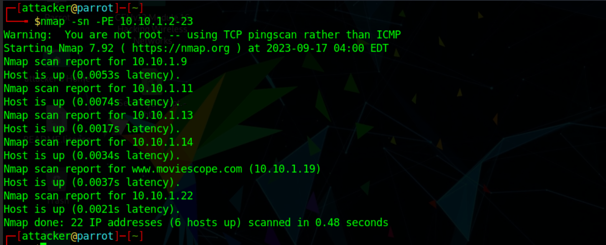

# Host Discovery

Host discovery is considered as the primary task in the network scanning process.  Host discovery provides an accurate status of the systems in the network, which enables an attacker to avoid scanning every port on every system in a list of IP addresses to identify whether the target host is up.

### Finding all IPs in a subnet using netdiscover

If you have an IP of 198.162.56.113 and you want to find the other IPs present in the subnet, you can use:

```
netdiscover -r 198.162.56.0/24
```

## Using Hping

### ICMP Ping

Hping performs an ICMP ping scan by specifying the argument `-1` in the command line. You may use --ICMP or -1 as the argument in the command line.

```python
hping3 -1 10.0.0.25 
```

### ACK scan on a port

Hping can be configured to perform an ACK scan by specifying the argument -A in the command line.

```python
hping3 –A 10.0.0.25 –p 80
```

### UDP scan on a port

Using the argument `-2` in the command line specifies that Hping operates in the UDP mode. You may use either `--udp` or `-2` as the argument in the command line.

```python
hping3 -2 10.0.0.25 –p 80 
```

### Collecting Initial Sequence Number

Using the argument `-Q` in the command line, Hping collects all the TCP sequence numbers generated by the target host.&#x20;

```python
hping3 192.168.1.103 -Q -p 139
```

### Firewall Evasion with TCP timestamps

Many firewalls drop those TCP packets that do not have the TCP Timestamp option set. By adding the `--tcp-timestamp` argument in the command line, you can enable the TCP timestamp option in Hping and try to guess the timestamp update frequency and uptime of the target host.

```python
hping3 -S 72.14.207.99 -p 80 --tcp-timestamp
```

### SYN scan

The argument `-S` allows you to perform a SYN scan.

```python
hping3 –S 10.0.0.25 –V -p 80
```

### Scan over a range of ports

Using the argument `-8` or `--scan` in the command line, you are operating Hping in the scan mode to scan a range of ports on the target host.

```python
hping3 -8 50-60 –S 10.0.0.25 –V
```

### FIN, PSH and URG scan

By adding the arguments `–F`, `–P`, and `–U` in the command line, you are setting FIN, PUSH, and URG packets in the probe packets.

```python
hping3 –F –P –U 10.0.0.25 –p 80
```

### Scan entire subnet for live host

```python
hping3 -1 10.0.1.x --rand-dest –I eth0
```

By issuing this command, Hping performs an ICMP ping scan on the entire subnet 10.0.1.x; in other words, it sends an ICMP echo request randomly (`--rand-dest`) to all the hosts from 10.0.1.0 to 10.0.1.255 that are connected to the interface eth0.

### Intercept all traffic containing HTTP signature

The argument -9 will set the Hping to the listen mode. Hence, by issuing the command -9 HTTP, Hping starts listening on port 0 (of all the devices connected in the network to interface eth0), intercepts all the packets containing the HTTP signature, and dumps from the signature end to the packet's end.

```python
hping3 -9 HTTP –I eth0
```

### SYN flooding a victim

```python
hping3 -S 192.168.1.1 -a 192.168.1.254 -p 22 --flood 
```

## Using Nmap

The `-sn` flag turns on Host discovery for Nmap. &#x20;

| Option | Purpose                          |
| ------ | -------------------------------- |
| `-n`   | no DNS lookup                    |
| `-R`   | reverse-DNS lookup for all hosts |
| `-sn`  | host discovery only              |

### ARP Ping Scan

More efficient and accurate than other host discovery techniques. Useful for system discovery, where one may need to scan large address spaces.

On an Ethernet (802.3) and WiFi (802.11), you need to know the MAC address of any system before you can communicate with it. The MAC address is necessary for the link-layer header; the header contains the source MAC address and the destination MAC address among other fields. To get the MAC address, the OS sends an ARP query. A host that replies to ARP queries is up. The ARP query only works if the target is on the same subnet as yourself, i.e., on the same Ethernet/WiFi.

If we get a ARP response - Host is active, else Host is inactive.

```bash
nmap -sn -PR <Target IP Address> 
```

ARP scan is possible only if you are on the same subnet as the target systems.

### UDP Ping Scan

Detects systems behind firewalls with strict TCP filtering. UDP response - Host is active.

```bash
nmap -sn -PU <Target IP Address> 
```

### ICMP ECHO Ping Scan&#x20;

ICMP ECHO reply - Host is active. Useful for locating active devices or determining if the ICMP message passes through a firewall.&#x20;

Does not work on Windows-based networks.

```bash
nmap -sn -PE <Target IP Address>
```

```
# For ICMP ECHO Ping Sweep
 use <Target IP Address Range>
```

<figure><figcaption><p>ICMP ECHO Ping Scan (Requires sudo) </p></figcaption></figure>

<figure><figcaption><p>Without sudo defaults to TCP pingscan</p></figcaption></figure>

### ICMP Timestamp Ping Scan&#x20;

Determines whether the target host is live, specifically when the administrators block ICMP ECHO pings. Timestamp reply to each timestamp request. Response from the destination host is conditional, and it may or may not respond with the time value depending on its configuration by the administrator at the target’s end.

```bash
nmap –sn –PP <Target IP Address>
```

### ICMP Address Mask Ping Scan

Send an ICMP address mask query to the target host to acquire information related to the subnet mask.

```bash
nmap –sn –PM <Target IP Address>
```

Address mask response from the destination host is conditional, and it may or may not respond with the appropriate subnet value depending on its configuration by the administrator at the target’s end.

### TCP SYN Ping Scan

Logs are not recorded at the system or network level, enabling the attacker to leave no traces for detection.

<pre><code><strong>nmap –sn –PS &#x3C;Target IP Address>
</strong></code></pre>

<figure><figcaption><p>TCP SYN Ping scan on a IP range (10.10.1.2-23)</p></figcaption></figure>

### TCP ACK Ping Scan

Maximizes the chances of bypassing the firewall. Firewalls are mostly configured to block the SYN ping packets, as they are the most common pinging technique.

**Requires sudo/administrator privileges**

```
nmap –sn –PA <Target IP Address>
```

### IP Protocol Ping Scan

Sends different packets using different IP protocols in the hope of receiving a response indicating that a host is online.

```
nmap –sn –PO <Target IP Address>
```

## Summary of Nmap Scans

| Scan Type              | Example Command                             |
| ---------------------- | ------------------------------------------- |
| ARP Scan               | `sudo nmap -PR -sn MACHINE_IP/24`           |
| ICMP Echo Scan         | `sudo nmap -PE -sn MACHINE_IP/24`           |
| ICMP Timestamp Scan    | `sudo nmap -PP -sn MACHINE_IP/24`           |
| ICMP Address Mask Scan | `sudo nmap -PM -sn MACHINE_IP/24`           |
| TCP SYN Ping Scan      | `sudo nmap -PS22,80,443 -sn MACHINE_IP/30`  |
| TCP ACK Ping Scan      | `sudo nmap -PA22,80,443 -sn MACHINE_IP/30`  |
| UDP Ping Scan          | `sudo nmap -PU53,161,162 -sn MACHINE_IP/30` |

Remember to add `-sn` if you are only interested in host discovery without port-scanning. Omitting `-sn` will let Nmap default to port-scanning the live hosts.
