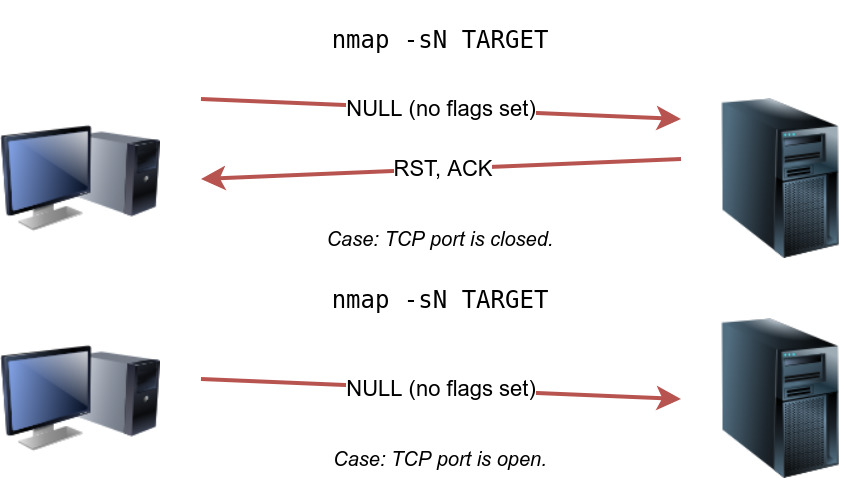

# Port Scanning - Service and OS Discovery

Discovery of open ports and services can be performed via various port scanning techniques. Administrators often use port scanning techniques to verify the security policies of their networks, whereas attackers use them to identify open ports and running services on a host with the intent of compromising the network.

At the risk of oversimplification, we can classify ports in two states:

1. Open port indicates that there is some service listening on that port.
2. Closed port indicates that there is no service listening on that port.

However, in practical situations, we need to consider the impact of firewalls. For instance, a port might be open, but a firewall might be blocking the packets.&#x20;

## Nmap port states

Nmap considers the following six states:

1. **Open**: indicates that a service is listening on the specified port.
2. **Closed**: indicates that no service is listening on the specified port, although the port is accessible. By accessible, we mean that it is reachable and is not blocked by a firewall or other security appliances/programs.
3. **Filtered**: means that Nmap cannot determine if the port is open or closed because the port is not accessible. This state is usually due to a firewall preventing Nmap from reaching that port. Nmap’s packets may be blocked from reaching the port; alternatively, the responses are blocked from reaching Nmap’s host.
4. **Unfiltered**: means that Nmap cannot determine if the port is open or closed, although the port is accessible. This state is encountered when using an ACK scan `-sA`.
5. **Open|Filtered**: This means that Nmap cannot determine whether the port is open or filtered.
6. **Closed|Filtered**: This means that Nmap cannot decide whether a port is closed or filtered.

| Option                  | Purpose                                  |
| ----------------------- | ---------------------------------------- |
| `-p-`                   | all ports                                |
| `-p1-1023`              | scan ports 1 to 1023                     |
| `-F`                    | 100 most common ports                    |
| `-r`                    | scan ports in consecutive order          |
| `-T<0-5>`               | -T0 being the slowest and T5 the fastest |
| `--max-rate 50`         | rate <= 50 packets/sec                   |
| `--min-rate 15`         | rate >= 15 packets/sec                   |
| `--min-parallelism 100` | at least 100 probes in parallel          |

You might consider adding `--reason` if you want Nmap to provide more details regarding its reasoning and conclusions.

### Service Version Discovery: the -`sV` option is used to detect service versions.

## TCP Connect/Full-Open Scan

Sends in  SYN packets for request. If SYN+ACK packet response - Port is open. If RST packet response - Port is closed.&#x20;

Disadvantage: Easily detectable and filterable. The logs in the target system disclose the connection.

```bash
nmap –sT –v <Target IP Address>
```

## Stealth Scan (Half-Open Scan)

Sends in a single SYN packet. Bypasses firewall rules and logging mechanisms.

```
nmap –sS –v <Target IP Address>
```

## Inverse TCP Flag Scan

Sends in a probe packet (FIN/URG/PSH/NULL). If no response is received port is open. If **RST** packet **response is received port is closed**. Avoids many IDS and logging systems; highly stealthy.

Disadvantage: Not effective against Microsoft Windows hosts, in particular.

```
nmap –(-sF, -sN, -sX) –v <Target IP Address>
```

The `-sF` flag is used for FIN scan and `-sN` is for NULL scan.

<figure><figcaption><p>FIN Scan Methodology</p></figcaption></figure>

<figure><figcaption><p>NULL scan methodology</p></figcaption></figure>

## Xmas Scan

Avoids IDS and the TCP three-way handshake. Sends a probe packet (FIN + URG + PSH).  No response - Port is open. RST packet response - Port is closed. Works only when systems are compliant with the RFC 793–based TCP/IP implementation and the Unix platform only.&#x20;

```
nmap –sX –v <Target IP Address>
```

<figure><figcaption><p>Xmas  Scan Methodology</p></figcaption></figure>

## ACK Scanning

Can evade IDS in most cases Helps in checking the filtering systems of target networks.  But it can be extremely slow and can exploit only older OSes with vulnerable BSD-derived TCP/IP stacks.

<table data-header-hidden><thead><tr><th width="129">Type</th><th width="175">Command</th><th width="120">Request</th><th width="349">Response</th></tr></thead><tbody><tr><td>ACK Flag Probe Scan</td><td><code>nmap -sA -V &#x3C;Target IP></code></td><td>ACK probe packets</td><td><ul><li>No response Port is filtered (stateful firewall is present).</li><li>RST packet response Port is not filtered (no firewall is present)</li></ul></td></tr><tr><td>TTL-Based ACK Flag Probe Scan</td><td><code>nmap -sA -ttl 100 -v &#x3C;Target IP></code></td><td>ACK probe packets (several thousands) to different TCP ports</td><td><ul><li>RST packet response Port is <strong>open</strong> (<strong>TTL value on a port &#x3C; 64)</strong>. </li><li>RST packet response - Port is <strong>closed</strong> (<strong>TTL value on a port > 64</strong>)</li></ul></td></tr><tr><td>Window-Based ACK Flag Probe Scan</td><td><code>nmap -sA -sW &#x3C;Target IP></code></td><td>ACK probe packets (several thousands) to different TCP ports</td><td><ul><li><strong>RST</strong> packet response -Port is <strong>open</strong> (<strong>WINDOW value on a port is non-zero</strong>). </li><li><strong>ICMP unreachable</strong> error response - Port is <strong>filtered</strong>. </li><li><strong>RST</strong> packet response Port is <strong>closed</strong> (<strong>WINDOW value on a port is zero</strong>).</li></ul></td></tr></tbody></table>

## TCP Maimon Scan

Uriel Maimon first described this scan in 1996. In this scan, the FIN and ACK bits are set. The target should send an RST packet as a response. However, certain BSD-derived systems drop the packet if it is an open port exposing the open ports. This scan won’t work on most targets encountered in modern networks.

To select this scan type, use the `-sM` option.

```
sudo nmap -sM 10.10.252.27
```

### Null, FIN, and Xmas scan provoke a response from closed ports, while Maimon, ACK, and Window scans provoke a response from open and closed ports.

## UDP Scan

Less informal with regard to an open port because there is no overhead of a TCP handshake. Microsoft-based OSes do not usually implement any ICMP rate limiting; hence, this scan operates very efficiently on Windows-based devices.

```
nmap –sU –v <Target IP Address>
```

## SCTP Scans

### SCTP INIT Scan

Sends a INIT chunk. An INIT scan is performed quickly by scanning thousands of ports per second on a fast network not obstructed by a firewall, offering a strong sense of security. Can clearly differentiate between various ports such as open, closed, and filtered states.

INIT+ACK chunk - Port is open. ICMP unreachable exception - Port is filtered. ABORT chunk - Port is closed

```
nmap -SY -V <Target IP>
```

### SCTP Cookie ECHO Scan

Sends in a COOKIE ECHO chunk. The COOKIE ECHO chunk is not blocked by non-stateful firewall rule sets. Only an advanced IDS can detect an SCTP COOKIE ECHO scan.  No response Port is open ABORT chunk Port is closed.&#x20;

```
nmap -sZ -V <Target IP>
```

Cannot differentiate clearly between open and filtered ports, showing the output as open filtered in both cases.

## OS Discovery

### Based on TTL

| Operating System | Time To Live | TCP Window Size            |
| ---------------- | ------------ | -------------------------- |
| Linux            | 64           | 5840                       |
| FreeBSD          | 64           | 65535                      |
| OpenBSD          | 255          | 16384                      |
| Windows          | 128          | 65,535 bytes to 1 Gigabyte |
| Cisco Routers    | 255          | 4128                       |
| Solaris          | 255          | 8760                       |
| AIX              | 255          | 16384                      |

Wireshark or unicornscan can be used to find the TTL and derive the OS being used by the target.

### Nmap

In Nmap, the `-O` option is used to perform OS discovery, providing OS details of the target machine.

```
nmap -O <Target IP>
```

The nmap scripting engine can also be used to find OS versions based on certain services like SMB. For example, in Nmap, smb-os-discovery is an inbuilt script that can be used for collecting OS information on the target machine through the SMB protocol.

## Scripting with Nmap

A part of Nmap, Nmap Scripting Engine (NSE) is a Lua interpreter that allows Nmap to execute Nmap scripts written in Lua language.

The `--script` option is used to specify the category or script name.

| Script Category | Description                                                            |
| --------------- | ---------------------------------------------------------------------- |
| `auth`          | Authentication related scripts                                         |
| `broadcast`     | Discover hosts by sending broadcast messages                           |
| `brute`         | Performs brute-force password auditing against logins                  |
| `default`       | Default scripts, same as `-sC`                                         |
| `discovery`     | Retrieve accessible information, such as database tables and DNS names |
| `dos`           | Detects servers vulnerable to Denial of Service (DoS)                  |
| `exploit`       | Attempts to exploit various vulnerable services                        |
| `external`      | Checks using a third-party service, such as Geoplugin and Virustotal   |
| `fuzzer`        | Launch fuzzing attacks                                                 |
| `intrusive`     | Intrusive scripts such as brute-force attacks and exploitation         |
| `malware`       | Scans for backdoors                                                    |
| `safe`          | Safe scripts that won’t crash the target                               |
| `version`       | Retrieve service versions                                              |
| `vuln`          | Checks for vulnerabilities or exploit vulnerable services              |

## Recap

| Port Scan Type                 | Example Command                                       |
| ------------------------------ | ----------------------------------------------------- |
| TCP Null Scan                  | `sudo nmap -sN 10.10.4.84`                            |
| TCP FIN Scan                   | `sudo nmap -sF 10.10.4.84`                            |
| TCP Xmas Scan                  | `sudo nmap -sX 10.10.4.84`                            |
| TCP Maimon Scan                | `sudo nmap -sM 10.10.4.84`                            |
| TCP ACK Scan                   | `sudo nmap -sA 10.10.4.84`                            |
| TCP Window Scan                | `sudo nmap -sW 10.10.4.84`                            |
| Custom TCP Scan                | `sudo nmap --scanflags URGACKPSHRSTSYNFIN 10.10.4.84` |
| Spoofed Source IP              | `sudo nmap -S SPOOFED_IP 10.10.4.84`                  |
| Spoofed MAC Address            | `--spoof-mac SPOOFED_MAC`                             |
| Decoy Scan                     | `nmap -D DECOY_IP,ME 10.10.4.84`                      |
| Idle (Zombie) Scan             | `sudo nmap -sI ZOMBIE_IP 10.10.4.84`                  |
| Fragment IP data into 8 bytes  | `-f`                                                  |
| Fragment IP data into 16 bytes | `-ff`                                                 |

| Option                   | Purpose                                  |
| ------------------------ | ---------------------------------------- |
| `--source-port PORT_NUM` | specify source port number               |
| `--data-length NUM`      | append random data to reach given length |

| Option     | Purpose                               |
| ---------- | ------------------------------------- |
| `--reason` | explains how Nmap made its conclusion |
| `-v`       | verbose                               |
| `-vv`      | very verbose                          |
| `-d`       | debugging                             |
| `-dd`      | more details for debugging            |

