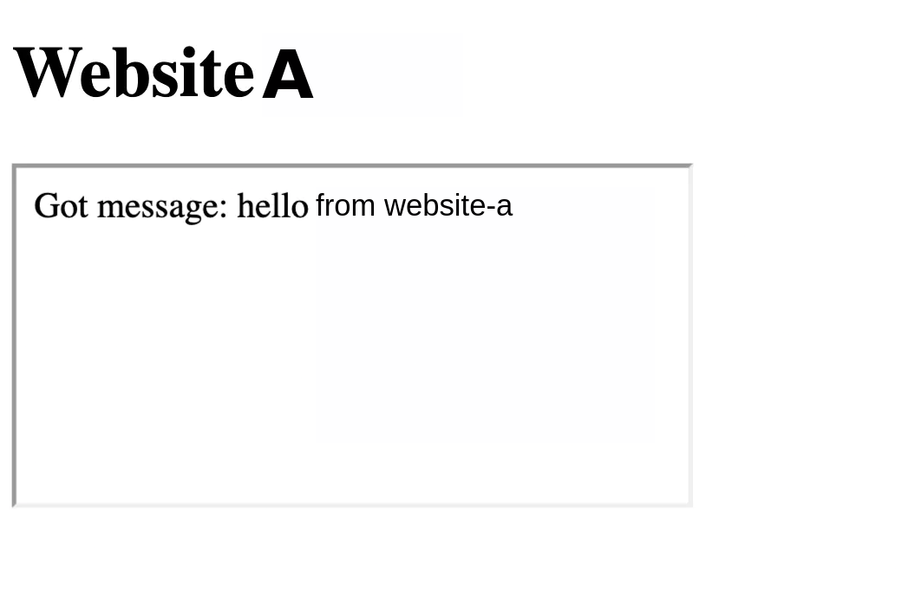

# Same Origin Policy

The Same Origin policy is a security mechanism which defines how a document, resource or script loaded from one origin interacts with another origin. It is a web browser security mechanism that prevents websites from "attacking" each other.

### What is an origin?

The origin of a URI is defined as the combination of its protocol/schema, the hostname and the port.  An example of this is shown below:


**Two URLs have the **_**same origin**_** if the** [**protocol**](https://developer.mozilla.org/en-US/docs/Glossary/Protocol)**,** [**port**](https://developer.mozilla.org/en-US/docs/Glossary/Port) **(if specified), and** [**host**](https://developer.mozilla.org/en-US/docs/Glossary/Host) **are the same for both.**&#x20;

### Why is SOP needed?

Let's take an example of two websites, `www.bank.com` a legit site, and `www.totallysafenothingmaliciousbank.com` an evil site. If the user is logged in `www.bank.com` and simultaneously opens `www.totallysafenothingmaliciousbank.com` in a new tab, the javascript code in the evil site can manipulate the legit site, **IF THE SAME ORIGIN POLICY IS NOT PRESENT**.

SOP actually helps in the separation of concerns. It helps isolate potentially malicious documents, reducing possible attack vectors.

### SOP Implementation

The same-origin policy prevents the above scenario from happening by blocking read access to resources loaded from a different origin.&#x20;

#### But we do load images, iframes, videos, fonts, scripts, etc from CDNs or other different origins, right?  How does it work in that case?&#x20;

**Answer:** Browsers allow a few tags to embed resources from a different origin. SOP is decided on multiple factors as shown in the table below:

<table><thead><tr><th width="106.33333333333331">Resource</th><th width="355">Allowed</th><th>Disallowed/Blocked</th></tr></thead><tbody><tr><td>iframe</td><td>Cross-origin embedding is usually permitted (depending on the <a href="security-headers/x-frame-options.md">X-Frame-Options</a> directive).</td><td>Cross-origin reading (such as using JavaScript to access a document in an iframe)</td></tr><tr><td>CSS</td><td>Cross-origin CSS can be embedded using a <code>&#x3C;link></code> element or an <code>@import</code> in a CSS file. The correct <code>Content-Type</code> header may be required.</td><td><p>Read the style contents, like using:</p><pre class="language-js" data-overflow="wrap"><code class="lang-js">console.log(document.styleSheets[0].cssRules)
</code></pre></td></tr><tr><td>forms</td><td>Cross-origin URLs can be used as the <code>action</code> attribute value of form elements. A web application can write form data to a cross-origin destination.<br><br>Credentialed cross-origin urlencoded HTML form and Multipart HTML form is allowed.</td><td>Credentialed cross-origin JSON HTML form is not allowed. The browser defaults to The browser will fallback to application/x-www-form-urlencoded.</td></tr><tr><td>images</td><td>Embedding cross-origin images is permitted.</td><td>Reading cross-origin image data (such as retrieving binary data from a cross-origin image, modifying pixels, etc, using JavaScript) is blocked.</td></tr><tr><td>scripts</td><td>Cross-origin scripts can be embedded. </td><td>however, access to certain APIs (such as cross-origin fetch requests) might be blocked.</td></tr></tbody></table>

## Deeper dive into what works and what doesn't

While the above table gives a gist about what's allowed and what's not. Let's take a closer look at them to understand the security concerns further.&#x20;

For this, we are going to take the help of two websites, say `www.website-a.com` and `www.website-b.com`

## Resource Embedding

### Loading styles

Stylesheets can be loaded using the `<link>` tag. But a cross-site stylesheet content access and modification using javascript is a bit restricted.

### Embedding images

Simple image loading with the `<image>` tag is allowed but the modification of image pixels etc isn't allowed.

Similarly, we can create a canvas for an image from literally any website, but, reading pixels from that canvas isn't allowed.&#x20;

## Javascript Controls

### Embedding scripts

JavaScript with `<script src="…"></script>`can be embedded without any issue, however, access to certain APIs (such as cross-origin fetch requests) might be blocked. Error details for syntax errors are only available for same-origin scripts.

In general, embedding any resource (image, style, script, etc.) is allowed cross-origin, but JavaScript cannot directly access the resource.

#### What's allowed?

**Reading scripts from different sites is allowed**

To explain this, let's take a situation, where we have the HTML page on `www.website-a.com` and the javascript code is being served from `www.website-b.com`.  Website-a embeds the scripts using a script tag (PS: this is how CDNs work).\
Now this is allowed by same-origin policy as **the "origin" of the script is the page it is executed in, not where it comes from** (Takes the quote "It's not where you are from, but, what you do that defines you" to another level :P).

#### Usage of data and functions provided by the embedded script

Let's say the script from the `website-b` has some variable x. We can actually `console.log()` it and see its value, even when it's not being served from `website-a`. This is how [JSONP](https://en.wikipedia.org/wiki/JSONP) works but it's not used anymore.

This has a direct security impact of making the website prone to XSSI (Cross-Site Script Inclusion) attacks if the website serves dynamic JavaScript files with authenticated user data in them.

#### What's not allowed?

#### Reading the script source - There is no way to do it anyway though

### Window Access

Generally, a website has complete control over the window that it's running on, but, there are many ways in which one website can control/handle another window.

Some of the methods include:\
&#x20;  1\. Using `window.open`.\
&#x20;  2\. Creating an `iframe`.\
&#x20;  3\. Using `window.opener` if the website is framed by another.\
&#x20;  4\. Using `postMessage()` method. &#x20;

#### Example snippet

Let's take an example snippet to understand the concepts stated below in this blog.&#x20;

```javascript
var crossOriginFrame = document.createElement('iframe')
crossOriginFrame.src = 'http://www.website-b.com'
document.body.appendChild(crossOriginFrame)
var contentWindow = crossOriginFrame.contentWindow
```

In the above script, we are creating a cross-origin frame within `http://www.website-a.com`. Now we will see what operations are allowed on the `contentWindow` we created.&#x20;

The **`contentWindow`** property returns the [Window](https://developer.mozilla.org/en-US/docs/Web/API/Window) object of an [HTMLIFrameElement](https://developer.mozilla.org/en-US/docs/Web/API/HTMLIFrameElement). You can use this `Window` object to access the iframe's document and its internal DOM. This attribute is read-only, but its properties can be manipulated like the global `Window` object.

#### What's allowed?

**Reading the number of frames in a cross-origin window**

For a window, we can know the number of frames it's embedding. So the following snippet is valid.

```javascript
console.log(contentWindow.frames.length);
```

#### Replacing/Write the source URI for the cross-origin frame

It is absolutely possible to replace the source URI of a cross-origin iframe. The following snippet is actually valid. &#x20;

```javascript
contentWindow.location.replace('https://www.example.com')
```

This has a direct security impact as the websites that you "frame" on your website can get a window handle to it via the [window.opener](https://developer.mozilla.org/en-US/docs/Web/API/Window/opener) property. This means that if you load a malicious website in an iframe on your website, the frame can change the URI of your site into, e.g., a phishing page.

This can be stopped by using the `sandbox` property.  The `sandbox` attribute enables an extra set of restrictions for the content in the iframe.

When the `sandbox` attribute is present, and it will:

* treat the content as being from a unique origin
* block form submission
* block script execution
* disable APIs
* prevent links from targeting other browsing contexts
* prevent content from using plugins (through `<embed>`, `<object>`, `<applet>`, or other)
* prevent the content to navigate its top-level browsing context
* block automatically triggered features (such as automatically playing a video or automatically focusing a form control)

The value of the `sandbox` attribute can either be empty (then all restrictions are applied) or a space-separated list of pre-defined values that will REMOVE the particular restrictions.

#### Sending messages to the window via `postMessage()`

The [postMessage](https://developer.mozilla.org/en-US/docs/Web/API/Window/postMessage) method allows cross-origin windows to communicate with each other. So let's say the iframe that we are loading (from website-b into website-a) has some way to parse the message sent to it, as shown in the snippet below:

```javascript
window.addEventListener(
  'message',
  (event) => {
    document.write('Got message: ' + event.data + 'from website-a')
  },
  false
)
```

Now when the script in `website-a` sends a message in the way shown below, the message simply gets reflected in the iframe, but, it's actually parsed and displayed by `website-b` behind the scenes.

```javascript
contentWindow.postMessage('hello', 'http://www.website-b.com')
```

<figure><figcaption><p>An example of how it would look after being rendered</p></figcaption></figure>

#### What's not allowed?

#### Reading/Writing cross-origin iframe content

Cross-origin reading (such as using JavaScript to access a document in a "cross-origin" iframe) and writing (using JavaScript to modify a document in a "cross-origin" iframe) aren't allowed.&#x20;

So the following snippets:&#x20;

```javascript
console.log(contentWindow.document.body.innerHTML);
```

```javascript
contentWindow.document.body.innerHTML = "<h1>Writing from website-a</h1>";
```

Throws the error:


```
Uncaught DOMException: Blocked a frame with origin "http://www.website-a.com" from accessing a cross-origin frame.
```


#### Reading the source URI of a cross-origin iframe

Yes! **`READING THE SOURCE URI ISN'T ALLOWED BUT WRITING/MODIFYING IT IS ALLOWED`**.&#x20;

```javascript
console.log(contentWindow.location.href) // Reading the source URI
```

Throws the error:


```
Uncaught DOMException: Blocked a frame with origin "http://www.website-a.com" from accessing a cross-origin frame.
```


#### Reading localStorage or sessionStorage via ContentWindow object of a cross-origin iframe <a href="#not-allowed-read-localstorage-or-sessionstorage" id="not-allowed-read-localstorage-or-sessionstorage"></a>

[`Window.localStorage`](https://developer.mozilla.org/en-US/docs/Web/API/Window/localStorage) returns a reference to the local storage object used to store data that may only be accessed by the origin that created it. This is a read-only attribute.

[`Window.sessionStorage`](https://developer.mozilla.org/en-US/docs/Web/API/Window/sessionStorage) returns a reference to the session storage object used to store data that may only be accessed by the origin that created it.

A cross-origin iframe window isn't allowed "read" access to the local storage and session storage objects. So the following snippets (similar ones too) are blocked by SOP:

```javascript
console.log(contentWindow.localStorage);
console.log(contentWindow.sessionStorage);
```

