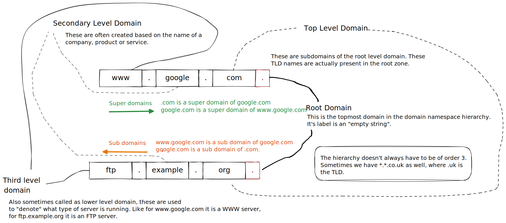

# Same Origin Policy

The Same Origin policy is a security mechanism which defines how a document, resource or script loaded from one origin interacts with another origin. It is a web browser security mechanism that prevents websites from "attacking" each other.

### What is an origin?

The origin of a URI is defined as the combination of its protocol/schema, the hostname and the port.  An example of this is shown below:

**Two URLs have the **_**same origin**_** if the** [**protocol**](https://developer.mozilla.org/en-US/docs/Glossary/Protocol)**,** [**port**](https://developer.mozilla.org/en-US/docs/Glossary/Port) **(if specified), and** [**host**](https://developer.mozilla.org/en-US/docs/Glossary/Host) **are the same for both.**&#x20;

### Why is SOP needed?

Let's take an example of two websites, `www.bank.com` a legit site, and `www.totallysafenothingmaliciousbank.com` an evil site. If the user is logged in `www.bank.com` and simultaneously opens `www.totallysafenothingmaliciousbank.com` in a new tab, the javascript code in the evil site can manipulate the legit site, **IF THE SAME ORIGIN POLICY IS NOT PRESENT**.

SOP actually helps in the separation of concerns. It helps isolate potentially malicious documents, reducing possible attack vectors.

### SOP Implementation

The same-origin policy prevents the above scenario from happening by blocking read access to resources loaded from a different origin.&#x20;

But we do load images, iframes, videos, fonts, scripts, etc from CDNs or other different origins, right?  How does it work in that case?
