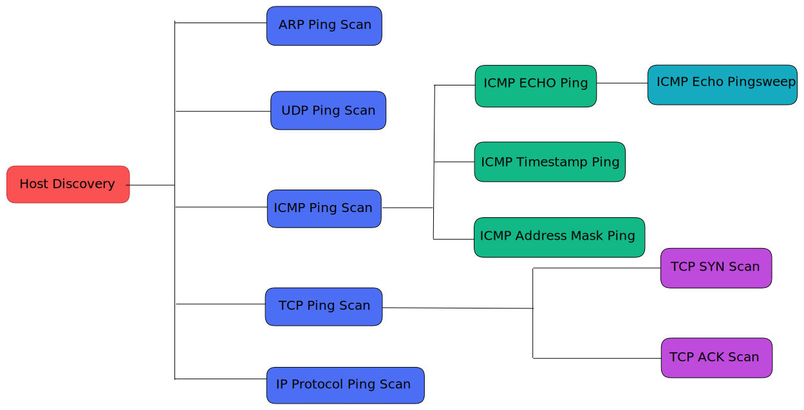

# Same Origin Policy

The Same Origin policy is a security mechanism which defines how a document, resource or script loaded from one origin interacts with another origin. It is a web browser security mechanism that prevents websites from "attacking" each other.

### What is an origin?

The origin of a URI is defined as the combination of its protocol/schema, the hostname and the port.  An example of this is shown below:

**Two URLs have the **_**same origin**_** if the** [**protocol**](https://developer.mozilla.org/en-US/docs/Glossary/Protocol)**,** [**port**](https://developer.mozilla.org/en-US/docs/Glossary/Port) **(if specified), and** [**host**](https://developer.mozilla.org/en-US/docs/Glossary/Host) **are the same for both.**&#x20;

### Why is SOP needed?

Let's take an example of two websites, `www.bank.com` a legit site, and `www.totallysafenothingmaliciousbank.com` an evil site. If the user is logged in `www.bank.com` and simultaneously opens `www.totallysafenothingmaliciousbank.com` in a new tab, the javascript code in the evil site can manipulate the legit site, **IF THE SAME ORIGIN POLICY IS NOT PRESENT**.

SOP actually helps in the separation of concerns. It helps isolate potentially malicious documents, reducing possible attack vectors.

### SOP Implementation

The same-origin policy prevents the above scenario from happening by blocking read access to resources loaded from a different origin.&#x20;

#### But we do load images, iframes, videos, fonts, scripts, etc from CDNs or other different origins, right?  How does it work in that case?&#x20;

**Answer:** Browsers allow a few tags to embed resources from a different origin. SOP is decided on multiple factors as shown in the table below:

| Resource | Allowed                                                                                                                                                                                                                                                          | Disallowed/Blocked                                                                                                                                                         |
| -------- | ---------------------------------------------------------------------------------------------------------------------------------------------------------------------------------------------------------------------------------------------------------------- | -------------------------------------------------------------------------------------------------------------------------------------------------------------------------- |
| iframe   | Cross-origin embedding is usually permitted (depending on the [X-Frame-Options](security-headers/x-frame-options.md) directive).                                                                                                                                 | Cross-origin reading (such as using JavaScript to access a document in an iframe)                                                                                          |
| CSS      | Cross-origin CSS can be embedded using a `<link>` element or an `@import` in a CSS file. The correct `Content-Type` header may be required.                                                                                                                      | 
Read the style contents, like using:
<pre class="language-js" data-overflow="wrap"><code class="lang-js">console.log(document.styleSheets[0].cssRules)
</code></pre> |
| forms    | 
Cross-origin URLs can be used as the <code>action</code> attribute value of form elements. A web application can write form data to a cross-origin destination.  Credentialed cross-origin urlencoded HTML form and Multipart HTML form is allowed.
 | Credentialed cross-origin JSON HTML form is not allowed. The browser defaults to The browser will fallback to application/x-www-form-urlencoded.                           |
| images   | Embedding cross-origin images is permitted.                                                                                                                                                                                                                      | Reading cross-origin image data (such as retrieving binary data from a cross-origin image, modifying pixels, etc, using JavaScript) is blocked.                            |
| scripts  | Cross-origin scripts can be embedded.                                                                                                                                                                                                                            | however, access to certain APIs (such as cross-origin fetch requests) might be blocked.                                                                                    |

